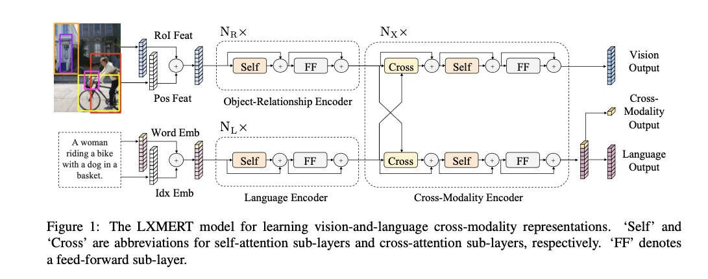
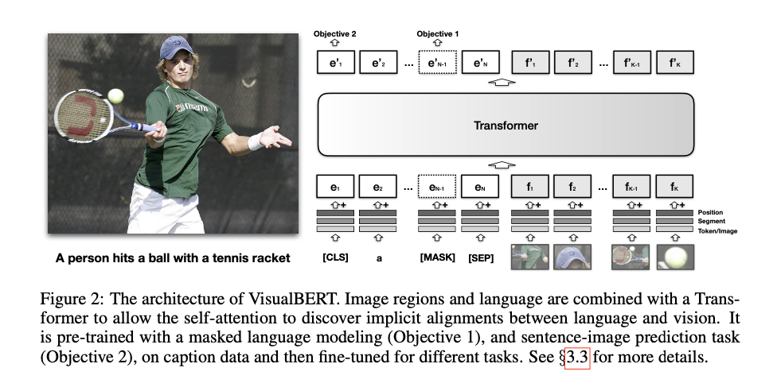
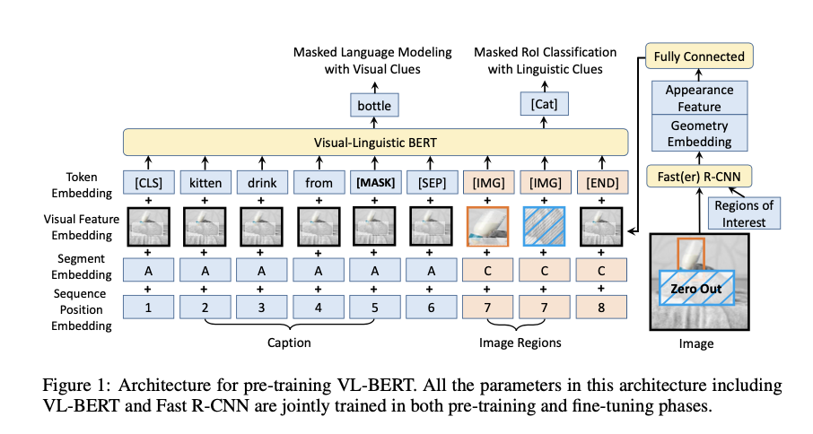
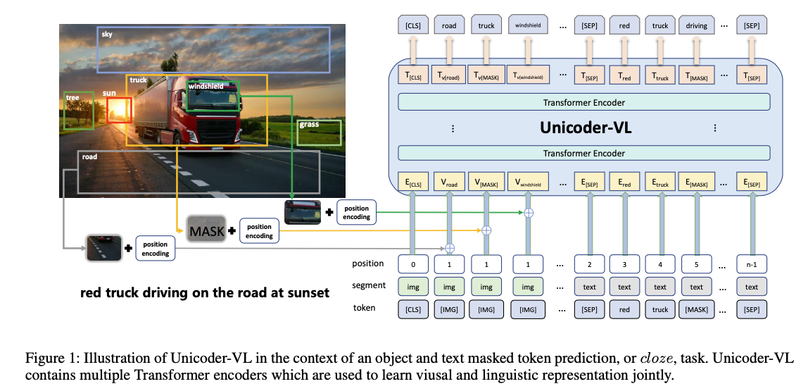
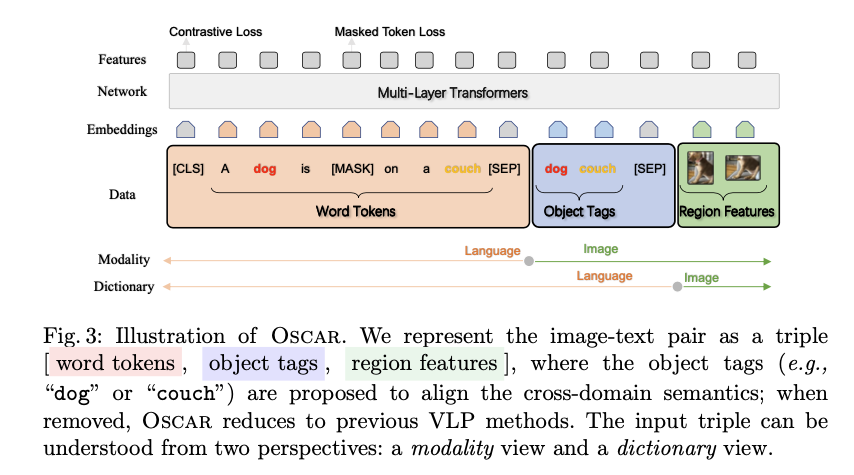
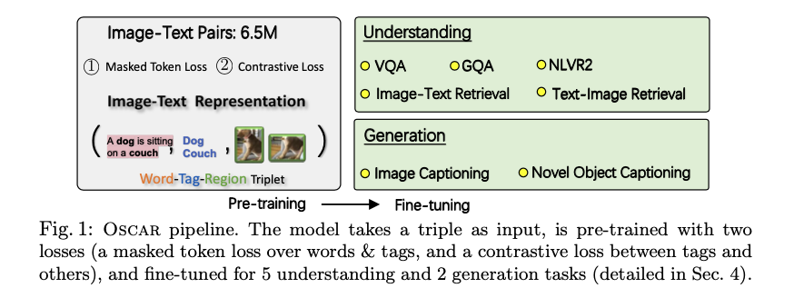
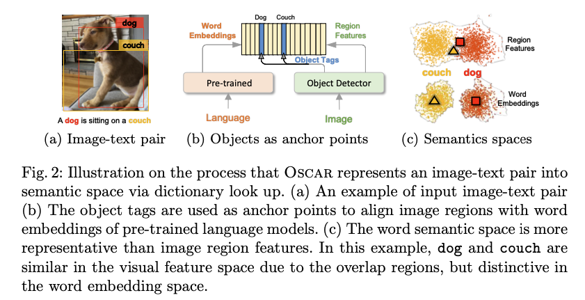
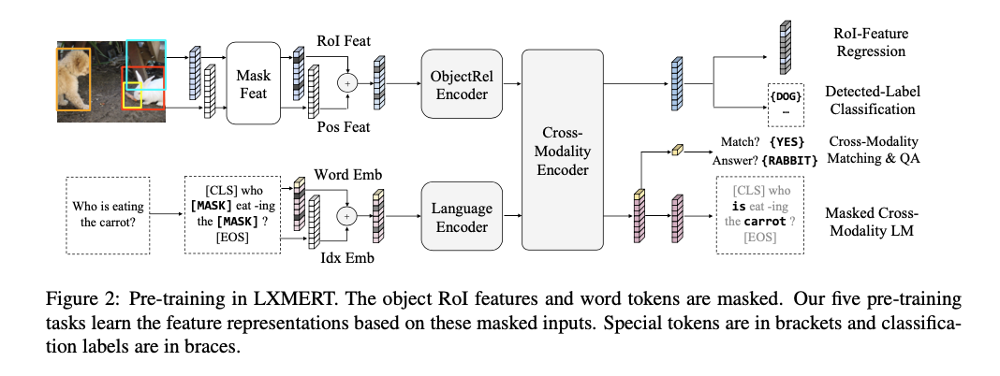
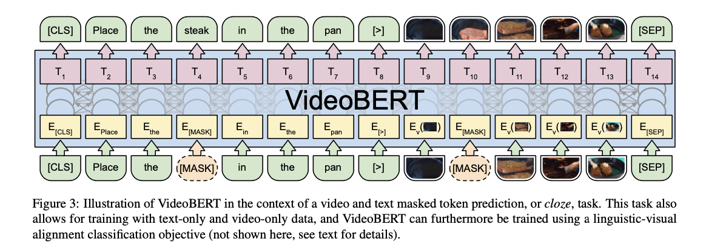
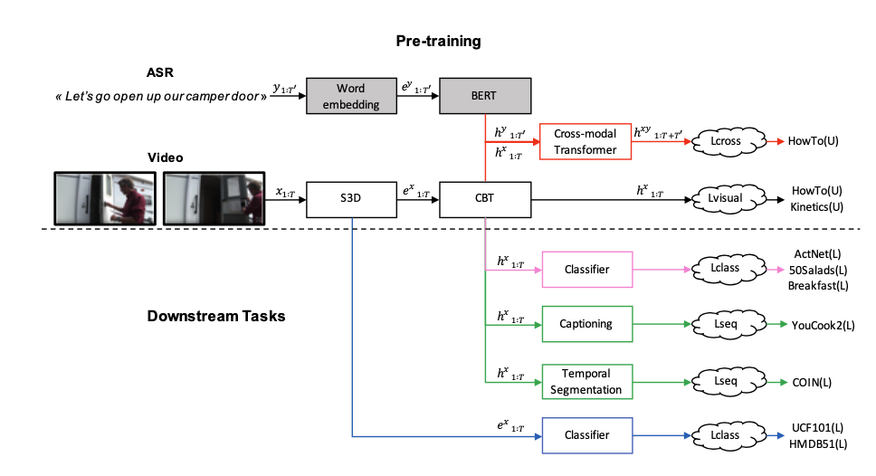

# language+vision 预训练模型


## idea -- 多模态融合

- 如何将图片特征与语言特征进行有效融合

现有的预训练方法采用句子级别与图片进行联合训练，我认为这种方式是不恰当的，因为图片本身就是一个 token 粒度的，而用token粒度去与句子粒度去一起训练是不合适的，我认为首要的任务还是如何将token粒度进行有效的融合。 此外，数据量也是需要考虑的事情。

## 单流模型与双流模型

### 单流模型

单流模型： 训练开始前融合多模态数据，只用一个 Transformer

### 双流模型




双流模型： 先对多模态数据进行独立编码，再进行融合。需要三个 Transformer 各自分工协作。 典型如LXMERT， ViLBERT。


## 1. Image-based 单流模型

### VisualBERT




### Vl-BERT




### Unicoder-VL




### OSCAR







## 2. Image-based 双流模型

### Vil-Bert


### LXMERT




### Welan


## 3. Video-based 单流模型

### VideoBERT



#### 1. 输入格式

```

```


## 4. Video-based 双流模型

### CBT




## Reference

**Image-based 单流模型：**

[1] Visualbert: A simple and performant baseline for vision and language  2019-8

[2] VL-bert: Pre-training of generic visual-linguistic representations  2019-8

[3 ]Unicoder-VL: A Universal Encoder for Vision and Language by Cross-modal Pre-training  2019-12

[4] B2T2：Fusion of detected objects in text for visual question answering.

[5] UNITER: Learning universal image-text representations   2019-9

[6] VLP: Unified Vision-Language Pre-Training for Image Captioning and VQA   2019-12

[7] FashionBERT- Text and Image Matching with Adaptive Loss for Cross-modal Retrieval   2020-5

[8] Imagebert: Cross-modal pre-training with large-scale weak-supervised image-text data  2020-1

[9] Pixel-bert: Aligning image pixels with text by deep multi-modal transformers  2020-4

[10] Oscar: Object-Semantics Aligned Pre-training for Vision-Language Tasks   - 2020-6

[11] M6: A Chinese Multimodal Pretrainer 2021-5


**Image-based 双流模型：**

[1] ViL-BERT: Pretraining Task-Agnostic Visiolinguistic Representations for Vision-and-Language Tasks  2019-8

[2] Lxmert: Learning cross-modality encoder representations from transformers. 2019-8

[3] ERNIE-ViL: Knowledge Enhanced Vision-Language Representations Through Scene Graph  - 2020-6

[4] WenLan: Bridging Vision and Language by Large-Scale Multi-Modal Pre-Training 2021-5


**Video-based 单流模型：**

[1] VideoBERT: A Joint Model for Video and Language Representation Learning  2019-9


**Video-based 双流模型：**

[1] CBT: Learning Video Representations Using Contrastive Bidirectional Transformer 2019-9

