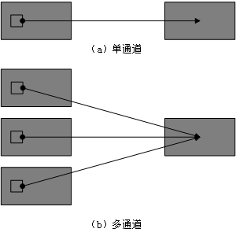
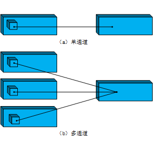

# CNN

tags: 深度学习

---

[TOC]

## 1. 卷积层

### 1. 原理


卷积操作原理上其实是对两个矩阵进行**点乘求和**的数学操作，其中一个矩阵为**输入的数据矩阵**，另一个矩阵则为**卷积核**（滤波器或特征矩阵），求得的结果表示为原始图像中提取的特定局部特征。

### 2. 卷积的作用

在图像领域中，深层卷积已经证明比浅层卷积更具表征，从图像的特征提取来看， 不同卷积操作提取到的特征类型是不相同的：

| 卷积层次 | 特征类型 |
| :------: | :------: |
| 浅层卷积 | 边缘特征 |
| 中层卷积 | 局部特征 |
| 深层卷积 | 全局特征 |

### 3. 一些常见的卷积核

在传统图像领域，已经证明一些特殊的卷积核能够执行边缘检测，锐化，模糊等操作， 如下表所示：

|         卷积作用         |                            卷积核                            |                     卷积后图像                     |
| :----------------------: | :----------------------------------------------------------: | :------------------------------------------------: |
|         输出原图         | $\begin{bmatrix} 0 & 0 & 0 \\ 0 & 1 & 0 \\ 0 & 0 & 0 \end{bmatrix}$ |                   |
| 边缘检测（突出边缘差异） | $\begin{bmatrix} 1 & 0 & -1 \\ 0 & 0 & 0 \\ -1 & 0 & 1 \end{bmatrix}$ |      |
|  边缘检测（突出中间值）  | $\begin{bmatrix} -1 & -1 & -1 \\ -1 & 8 & -1 \\ -1 & -1 & -1 \end{bmatrix}$ |    |
|         图像锐化         | $\begin{bmatrix} 0 & -1 & 0 \\ -1 & 5 & -1 \\ 0 & -1 & 0 \end{bmatrix}$ |          |
|         方块模糊         | $\begin{bmatrix} 1 & 1 & 1 \\ 1 & 1 & 1 \\ 1 & 1 & 1 \end{bmatrix} \times \frac{1}{9}$ |             |
|         高斯模糊         | $\begin{bmatrix} 1 & 2 & 1 \\ 2 & 4 & 2 \\ 1 & 2 & 1 \end{bmatrix} \times \frac{1}{16}$ |  |

### 4. 卷积核的参数

|    参数名    | 作用         | 常见设置                                                     |
| :----------: | :----------- | :----------------------------------------------------------- |
| Kernel Size  | 卷积核的大小 | 在过去常设为5，如LeNet-5；现在多设为3，通过堆叠$3\times3$的卷积核来达到更大的感受域 |
|    Stride    | 卷积步长     | 常见设置为1，表示滑窗距离为1，可以覆盖所有相邻位置特征的组合；当设置为更大值时相当于对特征组合降采样 |
|   Padding    | 填充策略     | `SAME`： 表示对不足卷积核大小的边界位置进行某种填充（通常零填充）以保证卷积输出维度与与输入维度一致；`VALID`时则对不足卷积尺寸的部分进行舍弃，输出维度就无法保证与输入维度一致 |
| In Channels  | 卷积核的深度 | 默认与输入的特征矩阵通道数（深度）一致；在某些压缩模型中会采用通道分离的卷积方式 |
| Out Channels | 卷积核的个数 | 若设置为与输入通道数一样的大小，可以保持输入输出维度的一致性；若采用比输入通道数更小的值，则可以减少整体网络的参数量 |

### 5. 几种常见的卷积方式 -TODO

https://zhuanlan.zhihu.com/p/28186857


### 6. 从 pytorch 看一维卷积，二维卷积，三维卷积

#### 参数说明

卷积操作常用的有一维卷积，二维卷积与三维卷积，其中，三维卷积用到就比较少了， 三个类在 Pytorch 中的参数都是一样的，只是输入输出维度有所差别罢了。

```
in_channels: 输入数据的通道数
out_channels: 卷积操作产生的输出通道数
kernels: 卷积核的大小， int 或 tuple， 卷积核的大小设置是需要反复实验测试的。
stride: 卷积步伐，stride 太小，会导致重复计算较多，计算量大； 而太大，有可能会造成特征遗漏。
padding: 输入数据的每一条边填充0的层数， int 或 tuple, 默认为0
padding_mode： 填充方式， zeros： 以0为填充数据
dilation: 卷积核中元素之间的间距， 默认为 1
groups: 从输入通道到输出通道的阻塞连接数， 默认为1
bias: 是否添加 bias， 默认为True
```

#### 一维卷积

```
class torch.nn.Conv1d:

-- 输入输出数据：
	Input: [N, C_in, L_in]: [batch_size, in_channels, input_len]
    Output: [N, C_out, L_out]: [batch_size, out_channels, output_len]

-- 参数：
	权重参数： [out_channels, in_channels/groups, kernel_size], 默认初始化为均匀分布 
	Bias参数： [out_channels], 默认初始化为均匀分布
```

$$
L_{out} = \frac{L_{in} + 2 * padding - dilation * (kernel\_size - 1)-1}{stride} + 1
$$

一维卷积在NLP中常用于 Embedding 部分来提取特征，如在TextCNN中就有使用， 此时可以将词向量维度理解为通道数`C_in`， 输入序列的长度为 `L_in`。

注意一点的是，在一维卷积中，卷积核的大小是一维的， 即如 果指定为 n， 则卷积核的大小为 `[n, 1, 1]`。 

#### 二维卷积



- 单通道：若输入卷积核尺寸为 $(k_h,k_w,1)$，卷积核在输入图像的空间维度上进行滑窗操作，每次滑窗和  $(k_h, k_w)$窗口内的值进行卷积操作，得到输出图像中的一个值。
- 多通道：输入图像特征通道数为3，卷积核尺寸为 $(k_h,k_w ,3)$ ,每次滑窗与3个通道上的 $(k_h , k_w) $窗口内的所有值进行卷积操作，得到输出图像中的一个值。

```
class torch.nn.Conv2d:

-- 输入输出数据：
	Input: [N, C_in, H_in, H_out, L_in]: [batch_size, in_channels, input_len]
    Output: [N, C_out, H_out, L_out]: [batch_size, out_channels, output_len]

-- 参数：
	权重参数： [out_channels, in_channels/groups, kernel_size], 默认初始化为均匀分布 
	Bias参数： [out_channels], 默认初始化为均匀分布
```


$$
H_{out} = \frac{H_{in} + 2 \times padding[0] - dilation[0] \times (kernel\_size[0] -1) - 1}{stride[0]} + 1 \\
W_{out} = \frac{W_{in} + 2 \times padding[1] - dilation[1] \times (kernel\_size[1] -1) - 1}{stride[1]} + 1
$$

#### 三维卷积




### 7. 卷积核的选择

大卷积核虽然可以获取更大的感受域，但是大卷积核反而会导致计算量大幅增加，不利于训练更深层的模型，相应的计算能力也会降低。

堆叠2个 **3×3** 卷积核（二通道）可以获得与 **5×5卷积核** 相同的感受视野，同时参数量会更少（3×3×2+1<5×5×1+1）,这也是 **3×3卷积** 应用更广泛的原因，在大多数情况下通过堆叠较小的卷积核比直接采用单个更大的卷积核会更加有效。

## 2. 激活层

激活层本质就是采用激活函数对卷积出的特征做一个非线性变换。

- 首选 Relu， 然后试试 Relu 变体 Leaky Relu 和 Maxout。
- 某些情况下 tanh 也能获得不错结果。

## 3. 池化层 -- 需要补充

池化层的**作用**是对感受域内的特征进行筛选，提取区域内最具代表性的特征，能够有效地降低特征尺度，进而减少模型所需要的参数量，此外还可以防止过拟合现象。

池化操作的本质是**降采样**。其除了能显著降低参数数量外，还能保持对平移，伸缩，旋转操作的不变性。

- 常见的池化操作：选择指导 (Boureau et al., 2010)

  > - 最大池化： Max Pooling
  > - 平均值池化： Mean Pooling

无论max pooling还是mean pooling,都没有需要学习的参数。因此，在**卷积神经网络**的训练中，Pooling层需要做的仅仅是将**误差层**传递到上一层，**而没有梯度的计算。**

对于max Pooling，下一层的误差项的值会原封不动的传递到上一层对应区块中的最大值所对应的神经元，而其他神经元的误差项都是0。

对于 mean Pooling， 下一层的误差项会均匀划分到该层的所有的神经元上。

## 4. 卷积层与池化层比较

|        |                 卷积层                 |              池化层              |
| :----: | :------------------------------------: | :------------------------------: |
|  结构  |   零填充时输出维度不变，而通道数改变   |  通常特征维度会降低，通道数不变  |
| 稳定性 | 输入特征发生细微改变时，输出结果会改变 | 感受域内的细微变化不影响输出结果 |
|  作用  |        感受域内提取局部关联特征        |  感受域内提取泛化特征，降低维度  |
| 参数量 |      与卷积核尺寸、卷积核个数相关      |          不引入额外参数          |

## 5. NLP 与 CV 中使用 CNN 的区别

|          | NLP                                           | CV                                        |
| -------- | --------------------------------------------- | ----------------------------------------- |
| 卷积核   | 多为一维卷积， 通常都是由较为浅层的卷积层组成 | 对二维信号做卷积，一般设为叠加的3×3卷积核 |
| Pooling  | 一般采用 Max-Pooling                          |                                           |
| 全连接层 | 一般常采用LN + dropout                        | 一般常采用BN + dropout                    |


---

## QA

### 1. 为什么需要 Padding ？

图像是 `5 × 5`的矩阵，我们的卷积核是 ` 3 × 3`的，最终我们得出的feature map是 `3 × 3 `的矩阵（`n -f + 1`) 。

这样会带来两个问题：

> - 每一次做卷积操作时，你的图像就会缩小，如果这种情况发生多次，你的图像就会变得很小。
>
> - 边缘的像素点所受到的关注点比中心的关注点少很多。比如上图的 `1 * 1` 的像素点只进行了一次卷积计算，而中心点 `3 * 3` 却进行了9次卷积计算，这明显是不公平的。这意味着图像边缘的信息大多都丢失了。

如果加上 paddding 之后，我们的 feature-map 就变为 `(n + 2p - f + 1) × (n + 2p - f + 1)`的矩阵。

Padding存在的意义在于：

> - 为了不丢弃原图信息
>
> - 为了保持feature map 的大小与原图一致
>
> - 为了让更深层的layer的 input 依旧保持有足够大的信息量
>
> - 为了实现上述目的，且不做多余的事情，padding出来的pixel的值都是0，不存在噪音问题。

### 2. 为什么卷积核设计尺寸都是奇数

- 保证像素点中心位置，避免位置信息偏移
- 填充边缘时能保证两边都能填充，原矩阵依然对称

### 3. 卷积操作的特点

- **稀疏交互：**卷积神经网络中，卷积核尺度远小于输入的尺度，这样每个输出神经网仅与前一层区域内的神经元存在连接权重，我们称此为稀疏交互。

  > - 提高了模型的统计效率：原本一幅图像只能提供少量特征，现在每一块像素区域都可以提供一部分特征
  > - 使得参数大量减少，优化的时间复杂度也会减小几个数量级，过拟合情况也得到改善。 
  > - 稀疏交互的意义在于，**先从局部的特征入手，再将局部特征组合起来形成更复杂和抽象的特征**。

- **参数共享：** 参数共享指的是**同一个模型的不同模块中使用相同的参数**。参数共享的意义在于使得卷积层具有**平移等特性**。

  > - 权重共享一定程度上能增强参数之间的联系，获得更好的**共性特征**。
  > - 很大程度上降低了网络的参数，**节省计算量和计算所需内存**。
  > - 权重共享能起到**很好正则的作用**。正则化的目的是为了降低模型复杂度，防止过拟合，而权重共享则正好降低了模型的参数和复杂度。

- **平移不变性：**（局部）平移不变性是一个很有用的性质，尤其是当我们关心某个特征**是否出现**而不关心它出现的具体位置时。平移不变性是由于**参数共享 和池化** 所带来的。

### 4. 你觉得 CNN 有什么不足？

- **信息损失问题。** CNN在Pooling的时候会丢失大量的有价值信息，以及忽略局部与整体之间的关联性比如得分最高的特征只出现了一次，而得分第二高的特征出现了很多次，得分第二高的特征可能比最高的特征还要重要，却被丢弃了，自然造成了不小的信息损失

- **忽略了位置信息**：一个区域有用的特征极有可能和另一个区域的信息有联系，如TextCNN：对于一些粒度较粗的分类问题如话题分类，位置信息可能不大，但对于如情感分析这种粒度较细的分类问题，位置信息不足便会导致一些问题，如"虽然他长的很帅，但是人品不好"和"虽然他人品不好，但他长得帅啊"，在情感倾向上区别还是比较明显的。

### 5. CNN 与 RNN 的优劣

- 并行能力， 训练时间很漫长
- RNN 容易发生**梯度消失**，包括 LSTM
- CNN 的感受视野受限于卷积核，需要深层的 CNN 网络来获得更大的感受视野

### 6. 卷积，池化的意义

- 卷积和池化可能导致**欠拟合**
  - 如果一项任务涉及到要**对输入中相隔较远的信息进行合并**时，那么卷积可能就不正确了。
  - 如果一项任务依赖于保存**精确的空间信息**，那么在所有的特征上使用池化将会增大训练误差。
- 当我们比较卷积模型的统计学习表现时，只能以基准中的其他卷积模型作为比较的对象

### 7. 卷积中不同零填充的影响

假定 `m， k` 分别代表图像的宽度和卷积核的宽度：

- **Valid 卷积（有效卷积）**：不使用零填充，卷积核只允许访问那些图像中能够**完全包含整个核**的位置，输出的宽度为 `m − k + 1`
  - 在这种情况下，输出的所有像素都是输入中相同数量像素的函数，这使得输出像素的表示更加规范。
  - 然而，输出的大小在每一层都会缩减，这限制了网络中能够包含的卷积层的层数。（一般情况下，影响不大，除非是上百层的网络）
- **Same 卷积（相同卷积）：**只进行足够的零填充来**保持输出和输入具有相同的大小**，即输出的宽度为 `m`.
  - 在这种情况下，只要硬件支持，网络就能包含任意多的卷积层。
  - 然而，输入像素中靠近边界的部分相比于中间部分对于输出像素的影响更小。这可能会导致边界像素存在一定程度的欠表示。
- **Full 卷积（全卷积）：**进行足够多的零填充使得每个像素都能被访问 k 次（非全卷积只有中间的像素能被访问 k 次），最终输出图像的宽度为 `m + k − 1`
  - 因为 same 卷积可能导致边界像素欠表示，从而出现了 Full 卷积；
  - 但是在这种情况下，输出像素中靠近边界的部分相比于中间部分是更少像素的函数。这将导致**学得的卷积核不能再所有所有位置表现一致**。
  - 事实上，很少使用 Full 卷积

通常**零填充的最优数量**处于 “有效卷积”和 “相同卷积” 之间。

### 8. 1 * 1 卷积的作用？

<https://zhuanlan.zhihu.com/p/40050371>

- 实现信息的跨通道交互和整合。
- 对卷积核通道数进行降维和升维，减小参数量。

### 9. 卷积核是否越大越好？

卷积核越大，参数量越多。 前期无法使用较小卷积核是因为，前期的模型无法做的很深，这样限制了卷积核的感受视野。但其实，通过堆叠2 个 3 * 3 卷积核可以获得与 5 * 5 卷积核相同的感受视野，同时参数量特更少。 因此，大多数情况下，通过堆叠较小的卷积核比直接采用单个较大的卷积核更加有效。

自然语言中， TextCNN 就采用单层的卷积核，此时选择合适的，较大的卷积核相对比较重要， 而DPCNN 中，因为能够将卷积做的很深，那么就可以采用3 * 3 的卷积核来做了。

### 10. 如何减少卷积层参数量？

- 用深层小卷积代替浅层大卷积
- 使用分离卷积操作：将原本$K\times K\times C$的卷积操作分离为$K\times K\times 1$和$1\times1\times C$的两部分操作
- 添加 $1 \times 1$ 卷积
- 在卷积层前使用池化操作

### 11. CNN 特点

- **区域不变性：** filter 在每层的输入向量(图像)上滑动，检测的是局部信息，然后通过pooling取最大值或均值。pooling这步综合了局部特征，失去了每个特征的位置信息。

  这很适合基于图像的任务，比如要判断一幅图里有没有猫这种生物，你可能不会去关心这只猫出现在图像的哪个区域。但是在NLP里，词语在句子或是段落里出现的位置，顺序，都是很重要的信息。

- **局部组合性：** CNN中，每个滤波器都把较低层的局部特征组合生成较高层的更全局化的特征。

  这在CV里很好理解，像素组合成边缘，边缘生成形状，最后把各种形状组合起来得到复杂的物体表达。在语言里，当然也有类似的组合关系，但是远不如图像来的直接。而且在图像里，相邻像素必须是相关的，相邻的词语却未必相关。

### 12. 为何较大的batch size 能够提高 CNN 的泛化能力？

在相同迭代次数和学习率的条件下，每批次采用更多的数据将有助于模型更好的学习到正确的模式，模型输出结果也会更加稳定

### 13. SAME 与 VALID 的区别

- SAME： 宽卷积，通常采用零填充的方式对卷积核不满足整除条件的输入特征进行补全，以使卷积层的输出维度保持与输入特征维度一致。
- VALID：窄卷积，不进行任何填充，在输入特征边缘位置若不足以进行卷积操作，则对边缘信息进行舍弃，因此在步长为1的情况下该填充方式的卷积层输出特征维度可能会略小于输入特征的维度。

### 14. CNN 优缺点

**优点：**

- 共享卷积核，优化计算量。
- 无需手动选取特征，训练好权重，即得特征。
- 深层次的网络抽取图像信息丰富，表达效果好。
- 保持了层级网络结构。
- 不同层次有不同形式与功能。

**缺点：**

- 需要调参，需要大样本量，GPU等硬件依赖。
- 物理含义不明确。