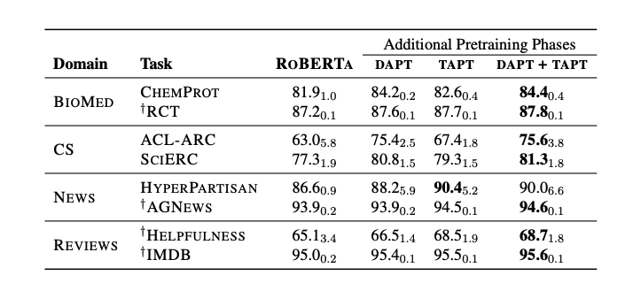

## 如何使用预训练模型

## 0. 基础概念

- **预训练：**指的是大公司通过大规模数据，大型网络所训练得出的模型，模型参数量往往很大

- **训练：** 指的是在预训练语言模型的基础上，再添加一些语料，接着训练语言模型，这对硬件的要求也很高，一般实验室玩不起。

- **微调：**指的是，不针对语言模型，而是针对特定任务，对上层模型与预训练语言模型进行微调，其实本质上还是对上层模型进行微调，对预训练语言模型进行微调在数据量较小的情况下所起到的作用不大。

## 1. 是否要进行微调[1]

我们是直接采用训练好的向量还是用预训练语言模型进行微调呢？

『冰』表示freeze， 『火』表示微调的结果。

实际上，对于大多数的任务， BERT 进行微调的方式总是比提取向量再训练的方式能够获得更佳的效果。因此，在条件允许的情况下，推荐采用微调的方式。

## 2. 是否要进行再次预训练[2]

答案是**需要**。

我们知道现在的预训练语料采用的都是百科，书籍等比较规范的数据，而实际业务中的数据千差万别，可以这么理解，预训练本身获得的是语料库中文本的分布，而如果预训练数据分布与业务数据分布偏差较大，会带来一些负面影响。 

因此，针对一些业务，如果数据与百科数据（预训练）差别非常大，先进行预训练，然后再进行微调是一种比较合适的方式。

我们这里简单介绍下[2] 中的结论：

1. 在目标领域的数据集上继续预训练（DAPT）可以提升效果；目标领域与语言模型的原始预训练语料越不相关，DAPT效果则提升更明显。
2. 在具体任务的数据集上继续预训练（TAPT）可以十分“廉价”地提升效果。
3. 结合二者（先进行DAPT，再进行TAPT）可以进一步提升效果。
4. 如果能获取更多的、任务相关的无标注数据继续预训练（Curated-TAPT），效果则最佳。

## 3. BERT 向量 vs Glove 向量

这篇文章对比了 BERT ，Glove，random 三种向量， 我们都知道， BERT 相对于其他两种向量，其效果提升非常明显，本文基于此，探讨与传统词向量相比，BERT向量优异在何处呢？

 为了对比不同词向量的在下游任务的表现，本文采用了三个任务： 

- NER： 词汇级别的任务
- sentiment analysis：句子级别的任务
- GLUE：句子对级别的任务

为了更加纯粹对比三种向量，三种词向量在训练时均不微调，如果微调的话，就会难以判断是模型的作用还是词向量本身的作用。

#### 1. 数据规模

实验表明，下游任务的训练数据对于不同的向量影响是十分不同的， 结果如下图所示：

从上图中我们可以看出

- 随着数据规模的扩大，Glove 向量的表现与 BERT 向量的表现差距越来越小，我们看到当训练数据足够多的时候，Glove 在一些任务上能够获得略差于BERT的影响，但是在绝大多数情况下依旧比BERT 向量差很多，这说明 BERT 对于小数据集的优越性。

- 在简单任务上，随着数据量的增加， Glove 能达到 BERT 十分接近的效果

### 2. 语言特性

接下来， 文章从三个角度来评测不同的向量：

- **the complexity of text structure：**句子结构的复杂性
- **Ambiguity in word usage**: 单词的歧义性。
- **Prevalence of unseen words**：未登录词出现的概率

从结果来看，**以 BERT 为代表的 Contextual embeddings 在解决一些文本结构复杂度高和单词歧义性方面有显著的效果**，但是在未登录词方面 GloVe 代表的Non-Contextual embeddings 有不错的效果。

从上面的结论可以看出，

- 在对于拥有大量训练数据和简单任务中，考虑算力和设备等，GloVe 代表的 Non-Contextual embeddings 是个不错的选择。
- 但是对于文本复杂度高和单词语义歧义比较大的任务，BERT代表的 Contextual embeddings 却有明显的优势。

## Reference

[1] Don’t Stop Pretraining: Adapt Language Models to Domains and Tasks

[2]  To tune or not to tune? adapting pretrained representations to diverse tasks. 

[3]  Contextual Embeddings: When Are They Worth It?

