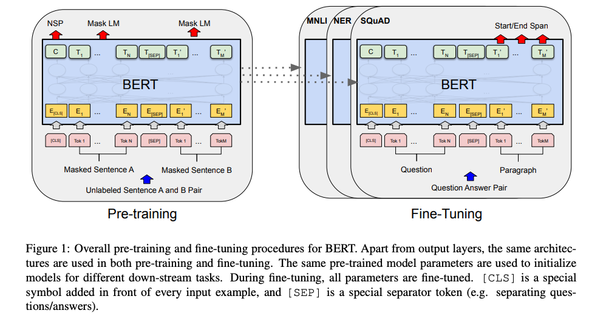
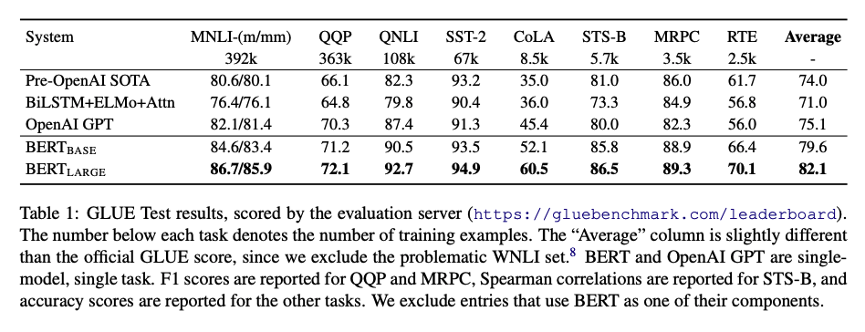
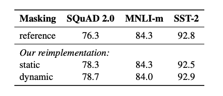
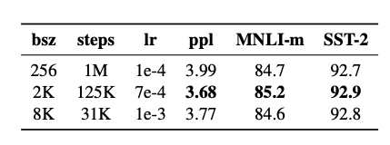
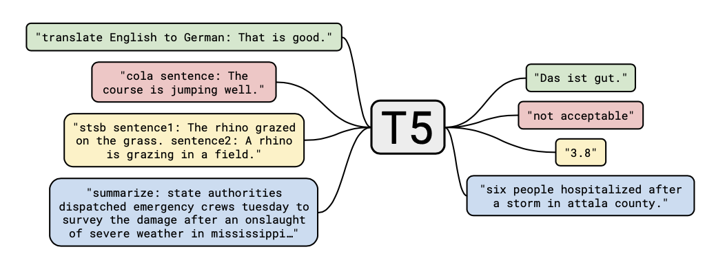
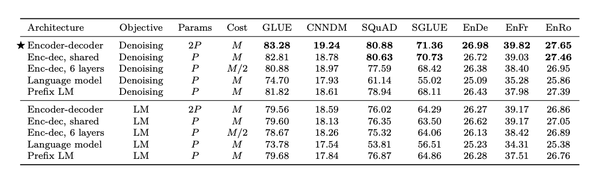
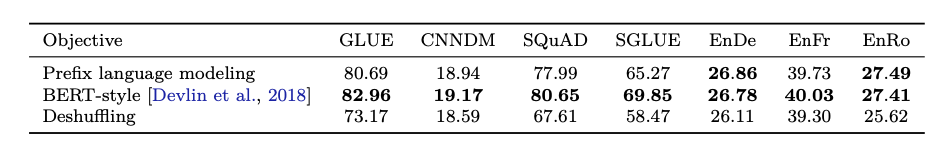
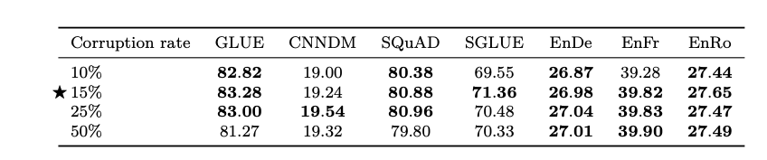
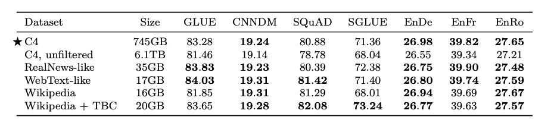
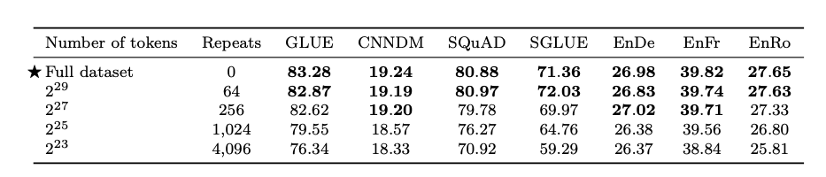

## BERT [1]

### 1 Model Architecture



Bert 模型结构上是一个多层，双向 Transformer encoder。

我们假定层数为 L， 隐层size为 H， self-attention heads 数目为A，那么有：

- $BERT_{BASE}$: L = 12, H=768, A= 12， 参数数量 110M, 即1.1亿
- $BERT_{LARGE}$: L = 24, H=1024, A= 16， 参数数量 340M， 即3.4亿

$BERT_{BASE}$ 与 OpenAI GPT 模型大小相同，主要是为了二者之间比较。 在下文，我们将双向Transformer称为 “ Transformer encoder”， 将单向（仅左）的Transformer称为 “Transformer decoder”。

### 2 Input Representation


- Token Embeddings：词向量，第一个单词是CLS标志，可以用于之后的分类任务

- Segment Embeddings：区别两种句子，因为预训练不光做LM还要做以两个句子为输入的分类任务
- Position Embeddings：**和之前文章中的Transformer不一样，不是三角函数而是学习出来的**


我们的 Input Representation 能够清楚的表示单一文本句子或句子对（如[Question, Answer]）。每个给定的token， 它的 input representation 是由 corresponding token， segment， 和 position embeddings 集合而成的。如图2所示。

细节如下：

- We use **WordPiece embeddings**  with a 30,000 token vocabulary. We denote split word pieces with ##.
-  We use **learned positional embeddings** with supported sequence lengths up to **512 tokens**.
- The first token of every sequence is always the **special classification embedding ([CLS]).** 
- Sentence pairs are packed together into a single sequence. We differentiate the sentences in two ways.
  - First, we separate them with a **special token ([SEP]).** 
  - Second, we add a learned sentence A embedding to every token of the first sentence and a sentence B embedding to every token of the second sentence.

### 3. Pre-training Tasks

BERT 使用两个新的无监督预测任务来训练。

**Task 1. Mased LM  - MLM**

为了训练深度双向表征，我们随机遮蔽输入 token 的某些部分，然后预测被遮住的 token。我们将此称为“masked LM”（MLM，类似于我们的完形填空）。在这种情况下，对应于遮蔽 token 的最终隐藏向量会输入到 softmax 函数中，并如标准 LM 中那样预测所有词汇的概率。在所做的所有实验中，我们随机遮住了每个序列中 15% 的 WordPiece token。

虽然该方法能够获得双向预训练模型，但该方法有两个弱点：

1. 训练与微调阶段的不一致性，因为训练阶段采用了 [MASK] 而 fine-tune 阶段并没有。 为了减轻该问题， we do not always replace “masked” words with the actual [MASK] token. 具体做法如下：

>  假如我们有一句话， my dog is hairy ， 被选中的词为hairy，数据生成器并不总是将hairy替换为[MASK]，此时的过程如下：
>  - 80% 情况下： 用[MASK] 替换 hairy
>  - 10% 情况下： 随机选一个词如apple 来替换hairy
>  - 10%: 不改变这句话

-  only 15% of tokens are predicted in each batch,  which suggests that more pre-training steps may be required for the model to converge.

**Task 2. Next Sentence Prediction - NSP**

语言模型不能获取两个句子之间的关系，因此我们预训练了一个  binarized next sentence prediction  task， 该任务可以从任意单语语料库中轻松生成。 

具体来说，我们选定一个句子A，B作为预训练样本，B有50%的可能是A的下一句，也有50%的可能是语料库的随机句子。举例而言：

```
- Input: [CLS] the man went to [MASK] store [SEP] he bought a gallon [MASK] milk [SEP]
- Label: IsNext

- Input: [CLS] the man [MASK] to the store [SEP] penguin [MASK] are flight ##less birds [SEP]
- Label: NotNext
```

### 4. Pre-training 训练细节

预训练数据集采用 **BooksCorpus（800M）**和 **English Wikipedia** 语料。

为了生成每个训练输入序列，我们从语料库中抽取两段文本，我们将其称为“句子”，尽管它们通常比单个句子长得多(但也可以短一些)。第一句记做 A embedding，第二句记做 B embedding。 50% 的情况下B是A的真正后一句话， 50%情况下B是一个随机句子。两个句子的总长度 <= 512 个 tokens。

我们设 batch_size = 256 ，则有256 sequences * 512 tokens = 128,000 tokens/batch， 训练步数为1000000步，大约33亿 word corpus 中的40个epoch。优化算法采用 Adam， 学习率设为 1e-4， $\beta_1 = 0.9， \beta_2 = 0.999$，  L2 权重衰减为 0.01。 在所有层使用dropout， 概率为0.1. 我们采用gelu激活函数而非relu。 训练损失为  the sum of the mean masked LM likelihood and mean next sentence prediction likelihood.

- $BERT_{BASE}$ 在 16个TPU芯片上进行训练
- $BERT_{LARGE}$ 在 64个TPU 芯片上进行训练

### 5. BERT 结果



### 6. 优点与缺点

**缺点：**

- 采用 mask 机制，导致预训练与微调阶段的不一致
- 每个batch只有15%的token被预测，所以BERT收敛得比left-to-right模型要慢


## RoBERTa

RoEBERTa 其实是对BERT的进一步探索，在同等参数量的情况下，探索了 BERT 关于数据量，模型架构，训练任务等问题，主要包含以下几个方面：

### 1. 训练数据比较： 

BERT采用了BOOKCORPUS 和英文维基百科， 总共16GB。而 RoBERTa采用了BOOKCORPUS + 英文维基百科+ CC-NEWS+OPENWEBTEXT+STORIES， 总共160GB。

Roberta 于bert 都采用 512 个token 作为序列长度，但与bert不同的是， robert 不会随机掺杂一些短句，这意味着 roberta 采用的都是长句。

### 2. dynamic masking vs static mask

在同等参数量级（bert-base）情况下，比较动态mask与静态mask的差别。

- **静态mask：**Bert 在准备训练数据时，每个样本只会进行一次随机mask，每个epoch都重复使用，后续的每个训练步都采用相同的mask。
- **修改版静态mask：** 在预处理时将数据集拷贝10次，每份数据采用不同的mask。
- **动态mask**：不在预处理时进行mask，而是在每次向模型输入时动态生成mask



从上表可以看出，修改版静态mask的确能够略微提升结果，而修改版静态mask结果与动态mask相差无几。

### 3. 数据格式与NSP 

本节探讨输入训练数据的格式以及NSP任务的必要性。主要通过四个对比实验


- **Segment-pair + NSP：**与bert一样。输入包含两个 segment，这两个segment可能会来自同一个文档或不同文档，两个segment 的token 数均小于 512，预训练任务包含 MLM 与 NSP。
- **Sentence+pair + NSP：**输入包含两个 sentence，两个句子可能来自同一文档或不同文档，两个句子 token 数均少于 512。预训练任务包含 MLM 与 NSP。
- **Full-sentences：**输入只有一部分，来自同一个文档或不同文档的连续句子，token总数不超过512。输入可能跨越文档边界，如果跨文档，则在上一个文档末尾添加文档边界token。不包含NSP任务。
- **Doc-sentences：**输入只有一部分，输入来自同一个文档的连续句子，token总数不超过512。预训练不包含 NSP 任务。

通过四个对比实验我们发现：

- Segment-pair 较好于 sentence-pair，可能是因为 segment 能够学习到长距离依赖关系。
- Doc-sentences 几乎在所有任务中表现最佳，这意味着 NSP 任务没有什么用
- Doc-sentences 略好于 Full-sentences。

### 4. batch size - 大大大

以往的神经机器翻译研究表明，采用非常大的mini-batches进行训练时候，搭配适当提高学习率既可以提高优化速度，又可以提高最终任务性能。

Bert 采用 batch-size 256，训练了1M 步。 此处比较了在保证总步数（batch_size * 步数）不变的情况下，增大 batch_size 所带来的变化。



通过上表可以发现，提高 batch_size，在总步数不变的情况下，增大学习率，最终获得的优化效果相差无几。

### 5. Text Encoding

BERT 采用 wordpiece 来进行分词

roberta 采用BPE 来分词

### 6. 训练细节


通过上表我们看到，增加数据量带来的效果是显而易见的，而训练时间越长，获得的结果越好，但训练到一定程度，增益已经非常缓慢了。


## SpanBERT

spanBERT 是对 BERT span 策略的进一步探索，其最重要的共现是发现了连续mask一段文本要比只mask字或word 要好很多，这一点在T5中也再次被证实了。

### Mask 策略

给定一段文本，随机mask 掉其中 15% 的span。 需要探索下，中文情况下， span的长度一般需要多长。

- 80% 情况下， span 被mask 为 [MASK]
- 10% 情况下，span 被替换为随机token
- 10%情况下，span为原始token


## 4. T5 [4]

T5 本质上就是解决了人们对如何才能训练一个好的 PTM 的疑问。

### 1. 数据才是正道 ：C4

**T5再次证明了数据的力量，没有什么是数据搞不定的，如果搞不定，那么再加点。**

搞数据一直是一个工作量比较大的事情，在实际业务中也必不可少，C4 的构建过程对实际还是有参考价值的。整个构建过程如下：

> **首先，**从Common Crawl 上获取了大量的文本，然后经过清洗后获得了750GB的高质量数据文本。 作为一名算法工程师，清洗数据在所难免，这里强调一下数据清洗的重要性。

文章中提到的清洗方法值得学习一下：

- 只保留以标点符号结尾的句子，这些表点符号包括句号，感叹号，问号以及引号。
- 删除任何带有“淫秽，色情，暴力”等词的句子，这些词可以可以从 [List-of-Dirty-Naughty-Obscene-and-Otherwise-Bad-Words](https://github.com/LDNOOBW/List-of-Dirty-Naughty-Obscene-and-Otherwise-Bad-Words) 查到。
- 删除所有带有JavaScript这一词的行。
- 包含 “lorem ipsum” 的页面。
- 删除所有带花括号（编程语言）的页面。
- 对于连续三句话重复出现的情况，只保留一个。

### 2. Text-to-Text： 模型归一

这部分算是本文真正的创新点之一，即将所有任务归结到一个大的框架下，即：Text-to-Text Transformer，其本质上是一个采用 标准Transformer（Attention is all you need） 来搭建的 Encoder-Decoder 框架，统一框架这就意味着对于所有的NLP任务，都采用一样的模型，一样的损失函数，一样的解码过程。其实本质上还是 Seq2Seq， 换汤不换药。

我们知道，NLP任务中包含多种任务，其实主要是生成任务，分类任务以及回归任务，Text-To-Text 对各种任务提出了统一的框架。

- **生成任务：** 直接通过Encoder-Decoder生成句子即可。思路跟传统的Encoder-Decoder一样。

- **分类任务**： 直接生成对应的标签，如情感分类任务，可以在句子前面加上："sentiment:"， 那么输出就会是 “negative” 或 “positive"。

- **回归任务：** 这里的处理感觉就没有大道至简的感觉，它将回归任务转化为了分类任务，比如1-5分，以 0.2 为间隔，划分为25个类，然后预测类别。感觉这里的处理有点为了归一而归一的意思。

  举个简单的例子，假如我想要预测北京房价，如果是人类预测，他首先判断，是在千万级别判断，然后得出在1kw以下，然后在百万级别判断，得出在200-300w之间，然后在在十万级别判断，是在20-30w之间，然后在万级别判断，是在5w-6w之间，以此类推，直到一定的精度。

  而如果模型要做的话，难道不应该直接生成吗？从[0-9.]中在合适的时间选择，这样才符合回归任务的本质吧。

模型的细节其实也值得探讨一下，主要包含以下几个方面，这些细节完全参照 BERT：

- **Layer Normalization：** 在每个 Block 的输入前使用
- **残差连接：** 将每个 Block 的输入与输出加起来
- **Dropout：** 用于 feed-forward 网络， 残差连接， attention weights， 以及整个stack 的输入输出。
- **Relative Position Embedding：** 与之前采用 **sinusoidal position signal**（attention is all you need 中使用的) 或 **学习的 position embedding**（BERT中使用的）不同， 本文中采用**相对位置编码**。

### 3. 评测模型

为了评估模型在各个任务上的表现， 文章将模型适配到各个主流数据集上，主要包含四大任务： 机器翻译，问答，文本摘要以及文本分类：GLUE， SuperGLUE， CNN/Daily Mail， SQuAD， WMT English to German, French, and Romanian translation。

为了在这些数据集上训练，且采用统一的框架 Text-to-Text， T5 参考了多任务学习时的做法，对每一个数据集都定义了特别的输入。 

- 对于翻译，如果是 English-to-German，那么格式为：

  ```
  input: translate English to German: That is good.
  output: Das ist gut.
  ```

- 对于分类：如针对 MNLI 数据集，则输入输出为：

  ```
  input: mnli premise: I hate pigeons. hypothesis: My feelings towards pigeons are filled with animosity.
  output: entailment
  ```

其他几个典型的输入输入输出如下图所示，这部分就不赘述了，其实没啥意思。



### 4.  Baseline

- **Model:** 采用标准 Encoder-Decoder Transformer（Attention is all you need），目的是能够在生成效果方面获得一些显著效果。Model size： 模型的 encoder， decoder size 接近，都采用跟 BERT base 一样多的 block（12个）。每个block的前馈神经网络输出纬度为$d_{ff}=3072$； attention机制的每个纬度为$d_{kv}=64$，采用12个head；sub-layers 与 embedding是的纬度为 $d_{model} = 768$。整个model 有 220 million 参数，是BERT-base的两倍。dropout = 0.1
- **Training：**损失函数采用标准的极大似然估计；优化器选择 AdaFactor；在test时，采用 greedy decoding；步数：$2^{19}=524288$；sequence length： 512； batch size 128。优化时的学习率衰减，在前 $10^4$采用 0.01 的学习率，在后面采用 $\frac{1}{\sqrt{max(n,k}}$ 对学习率进行衰减；其中 n是当前的 training iteration， k 是 warm-up steps（10^4）。
- **fine-tune**：步数： $2^{18}=262144$，batch size：128， sequence len：512；learning rate：0.001；每5000 steps 存 checkpoints。
- Vocabulary： SentencePiece + WordPiece。
- **Unsupervised objective**：

### 5. Architectures

模型结构中主要涉及两个方面： **模型架构** 与 **Attention mask 方式**。

#### 5.1 Attention mask 方式

在介绍这三种模型结构时，先来介绍 Attention 中的三种mask方式，mask方式的不同会极大的影响模型的效果，三种mask方式如下图所示：


三种mask 方式分别为：

- Fully-visible： 同时看上下文的信息，典型的就是BERT了。
- Causal：很常见的mask机制，分为从左到右，从右到左两种，当前点仅能看到之前的信息，而看不到之后的信息，具体可以参见《Attention is all you need》decoder 的输入部分。 同时， GPT 也是采用的这种方式，一般生成式语言模型都会采用这种方式：[Bert 之后：预训练语言模型与自然语言生成](https://zhuanlan.zhihu.com/p/70663422)
- Causal with prefix：典型的 UNILM 中的 Seq-to-Seq LM 就是这种做法。

#### 5.2 模型结构

模型架构中，主要有 **Encoder-Decoder，Language model，Prefix LM** 这三种，如下图所示：


- **Encoder-Decoder：**  encoder 采用**fully-visible** attention mask，decoder 中采用 **causal** attention mask。其实本质上与 "attention is all you need" 结构差不多。
- **Language model：** 该结构相当于上面的 decoder 部分，典型的如 GPT 就是，这里其实就是延续的 GPT  的思路。mask 方式当然是 Causal 了。
- **Prefix LM：** full-visible 与 causal 都有着各自的缺陷，见：[就最近看的paper谈谈预训练语言模型发展](https://zhuanlan.zhihu.com/p/79371603)。Causal with prefix算是二者的均衡。

**模型结构的最终实验结果如下：**



对于目标函数的选择，这里比较了 Denoising（BERT式）以及 LM（GPT式）两种方法。从上标中我们可以得出以下结论：

- Encoder-Decoder + Denoising 效果是最好的。
- Encoder 与 Decoder 之间共享参数能够获得相近的最好效果。
- Encoder与Decoder层数减半会损害结果。
- ALBERT 中发现共享 self-attention 参数能够降低参数量，但并不会带来很大的损害，参见：[ALBERT 告诉了我们什么？](https://zhuanlan.zhihu.com/p/92849070)
- 参数共享的Encoder-Decoder performance 优于 decoder-only prefix LM ，这说明 Encoder-Decoder 架构是有益的。
- Denoising 效果总是优于 LM 的效果。

### 6. unsupervised objectives


文章按照上图中的顺序，从左到右依次探讨。

#### 6.1   High-level approachs

首先是 High-level approachs， 此处主要探讨的是，几种常见不同的目标函数的结果，主要包括以下三种，它们的输入输出如上图所示：


图中，`<M> ` 表示 `[MASK]` 标志

- **Prefix language modeling：**该方法将句子分为两截，一部分作为输入到Encoder 中，另一部分作为Decoder的输出。
- **masked language modeling(MLM)：** 就是BERT那种形式。随机替换15%的token， 其中 90% 替换为[MASK]标志，10% 替换为随机token。
- **deshuffling objective：** 该方法会shuffle 句子中的token，并要求预测原始的句子。



三个结果的比较如上图所示， 我们看到， BERT-Style 的结果往往是最好的， prefix language modeling objective 能获得相近的结果。

#### 2. bert Mask 策略

本节第二部分就是进一步探讨， 在 BERT-Style 内部，哪种方式 mask 方式是最好的呢？


首先，第一个探讨的问题就是 mask 策略，如上图所示：

- **mask token：** mask 掉 token，将替换的token 换成 [MASK]（类似 BERT）
- **replace span：**为了提高计算效率。将句子中span的token替换为其他的token（类似 SpanBERT）
- **drop tokens：** 直接丢弃掉 tokens。


这三种方法的结果如上图所示，可以得出， Replace span的方法是最好的。

接下来就探讨，**应该mask 掉多少百分比的文本呢？**如下图所示，最终发现 15% 的效果是最好的。



最后， 前面得出要采用 replace span 方法，那么 **span 的长度应该采用多长呢**？结果如上图所示， 最终发现 3 的长度是最好的。


### 7. pre-training datasets

本节探讨预训练数据集的重要性，主要分为两个部分： **数据集的选择**以及**数据集大小**的选择。

#### 7.1 预训练数据集的选择

在数据集的选择中，主要比较了 **C4**， **Unfiltered C4**（未经过过滤的C4文本），**RealNews-like**，**WebText-like**，**Wikipedia**，**Wikipedia + Toronto Books Corpus** 这几个数据集， 其结果如下：



上表可以发现：

- Unfiltered C4 是未经过上述策略过滤的数据，与 C4 比较就可以发现， C4的效果明显提升，这再次验证了一个高质量数据集的重要性。
- Wikipedia + TBC 数据集在 SuperGLUE 上的表现要比 C4好，这说明预训练数据集与任务数据集之间的相关性是十分重要的。即 pre-training on in-domain unlabeled data can improve performance on downstream tasks. 但需要注意的是单领域的数据集往往较小，因此可能会产生一些问题。

#### 7.2 预训练数据集的大小

此处主要探讨两个问题：**数据集的大小**以及**样本重复**所带来的影响。我们选择的 Full Dataset 的大小为 $2^{35} B$ tokens，只是 C4 的一个子集。 实验结果如下：




从实验结果中我们可以看出：

- 随着数据集 size 的减小， performance 在降低。通过 Training loss 曲线，随着数据集size的减小， training loss，这说明存在一定的过拟合现象，模型对小的数据集存在 memorize 现象。
- 当样本重复64次时，所带来的影响是有限的，这说明一定程度的预训练数据重复并不会带来损害。

### 8. fine-tune

本节讨论了用于**如何在 Text-to-Text 上使用微调手段。**主要有三种手段：

- 微调 endocer-decoder 的所有参数。 
- **adapter layers：** 在decoder 外添加一层 dense-Relu-dense的 前馈网络，微调该前馈网络而不是微调所有参数。 同时， 该前馈网络的维度 d 的选择也十分重要，因此作者比较了多个维度。
- **gradual unfreezing：** 即随着时间的推移，越来越多的参数参与训练。最开始，只有最后一层开始训练，然后，随着时间推移，慢慢加入前面层的参数，直到所有的参数都参与训练。


从上图中我们发现：

- 微调所有参数往往能够获得最好的结果
- 对于 low-resource 的任务如 SQuAD， 即使是小的 d 也能工作的很好
- 对于 High-resource 任务往往需要更大 的 d
- 对于微调来说， adapter layers 是一个不错的手段，能够很好的权衡 performance 与 训练性能， 且 d 的选择也颇为重要。

### 9. Multi-task learning


### 10. Combining multi-task learning with fine-tuning


### 11. scaling


本节主要讨论了几个 **Scaling 策略**所带来的影响。主要涉及到的策略有：增大模型size， 增加 training steps， 增大 batch size。需要注意的是，**当增加 trainging steps与 batch size 时，也要相应的增加训练数据。**那其实问题就回到了，增加数据与增大模型所带来的效果增益。

从结果来看，**增加数据与增大模型对performance 都是有影响的**，且增大模型所带来的增益更大，且这两种 scaling 同时使用效果更佳。

### 12.  T5 模型： put it all together


## Questions

### 1. 为什么 BERT 结果好于 ELMO

1. Transformer 抽取特征的能力强于 LSTM
2. ELMO 中采用直接拼接进行多层向量融合的方式偏弱
3. BERT 参数量远多于 ELMO

### 2. 你觉得BERT 有哪些需要改进的地方


## Reference 

[1] BERT: Pre-training of Deep Bidirectional Transformers for Language Understanding

[2] RoBERTa: A Robustly Optimized BERT Pretraining Approach

[4] T5: Exploring the Limits of Transfer Learning with a Unified Text-to-Text Transformer

