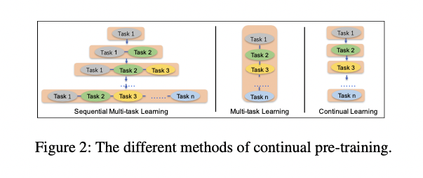
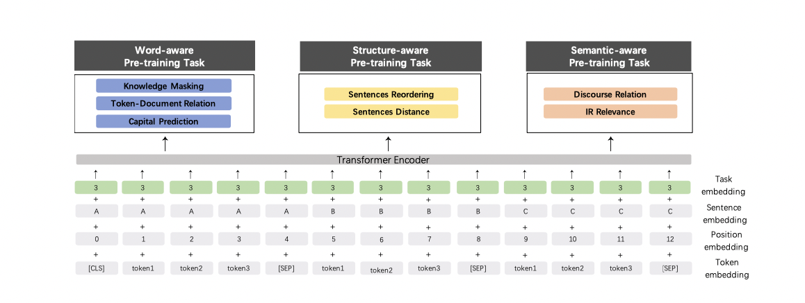
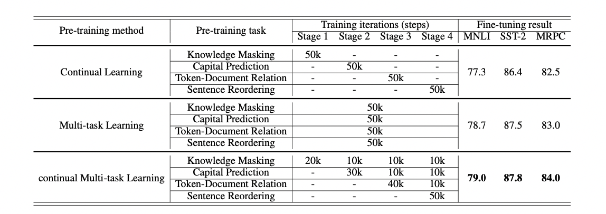

# 预训练语言模型 - ERNIE 系列

## 前言

最近恰逢百度 ERNIE 3.0 发布，效果也的确还不错，因此，老宋我就想着总结一下百度 ERNIE 系列在预训练语言模型+知识融合方面的探索。虽然ERNIE 3.0 目前无法使用（没错，自己厂内人士都用不了），但是理论角度还是得看看有啥新花样，不然老板心血来潮问起来，咱也不能不会阿。

## ERNIE 1.0 

对于 ERNIE 1.0 来说，其与 BERT 最大的不同就是融入了多级粒度的信息，如实体，短语等，这更加适用于中文这种具有先验信息的词汇，类似于中文中分词的道理一样。

### 1. 双向Transformer

ERNIE 同样采用多层的双向Transoformer 来作为特征提取的基本单元，这部分没啥创新，就是简单提一下。 

### 2. 不同粒度的信息融合

ERNIE 同样采用了多种粒度信息，只不过不同粒度信息的预训练过程与 Bert 不同， 对于一个 token， 其同样由 token embedding + segment embedding + position embedding 组成，与 bert 相同， 每一句话的第一个 token 都为 [CLS]。

### 3. Basic-Level Masking 预训练

这个过程与 Bert 中的 MLM 类似，是对于词粒度的预训练。 对于英文而言，粒度为 word， 对于中文而言，粒度为字。

随机 Mask 输入序列中 15% 的 token， 然后预测这些被 mask 掉的 tokens。这点与 Bert 相同， 不同的是，其论文中没有提到十分采用类似 Bert 的那种 Mask 的Trick 来降低预训练与预测的不一致性，这点需要看代码确认一下。

### 4. Phrase-level Masking 预训练

我个人认为短语级别的粒度信息对于中文，英文来说都是有用的。

对于中文来说， 比如 “放你一马”， 这从单单的字粒度信息是学习不到的，且这种信息相当多。而对于英文来说，英文短语也不在少数，就像： pull up, pull down, push up, push down 我觉得word粒度对这种短语信息也是难以捕捉的。

在这部分的预训练过程中，首先采用对应的工具识别出句子中存在的 Phrase， 然后随机 Mask 句子中的一些短语（文章并没有说 mask 多少百分比）， 然后预测 mask 掉的 Phrase 中的 word（字）， 即以 word（字）为预测单元。

### 5. Entity-level Masking 预训练

实体信息包括人名，地名，组织名称，产品名称等， 而实体又是一种抽象的概念，且通常包含着一些重要的信息，且实体之间的关系也十分重要。 ERNIE 先用命名实体识别找出句子中的实体，然后与 Phrase-level 一样， mask 其中的一些实体并预测这些mask掉的 word (字)。

对此，Entity-level Masking 预训练能够捕捉到实体的语义信息，这点是毋庸置疑的，但对于实体间关系的抽取，从模型上来看并不突出，希望有大佬解释一下（论文中是提到可以学习到实体间关系，只是我对此存疑）。

### 6. 多源数据

ERNIE 在预训练时采用了多源数据，包括：中文维基百科，百度百科，百度新闻，百度贴吧。其中，百度贴吧由于其社区的特性，里面的内容是对话形式的，而 ERNIE 中对于 Segement Embedding 预训练与 Bert 的 NSP 不同的是，其采用 DLM 来获得这种句子粒度级别的信息，而这对于句子语义的把握更佳准确。

### 7. DLM：Dialogue Language Model

对比 Bert 中的 NSP， 似乎 DLM 更能把握句子的语义信息，且对于对话，问答这种形式的任务效果更好。 DLM 的训练过程与 NSP 也有很大的区别，其输入如下：

为了使得 ERNIE 能够表示多轮对话，其输入采用QRQ, QQR,QRR（Q表示Query， R表示Response) 这几种形式， 如上图就是 QRQ 的一个例子。 ERNIE 会 mask 掉输入的一些 token， 然后让模型去预测这些被 mask 掉的 token（文章并没有给出mask比例以及如何分配mask）。 

同样有趣的是，ERNIE 也通过随机替换 Query 或 Response的方式来会添加一些 fake 样本来让模型去预测该输入是 real 还是 fake。

DLM 与 NSP 相比， 其更加复杂也更倾向于对话这种更高难度的任务，我个人认为，这种方式对于对话这种任务来说帮助很大。 

## ERNIE 2.0 

相比与BERT与ERNIE 1.0， ERNIE 2.0 的最大特点是预训练任务的增多。不同于BERT的两个预训练任务，ERNIE 1.0 的4个预训练任务， ERNIE 2.0 提出了9个预训练任务。

但是在大规模预训练的时候，当存在多个预训练任务时，往往在预训练后面任务的时候会丢掉一些前面任务所学习到的信息。为了减轻多个任务下学习的遗忘，ERNIE 2.0 中引入了 sequential multi-task learning。

通读整篇论文，没有看到各个预训练任务的消融实验，因此对于每个预训练任务尤其是 Structure-aware 与 Semantic-aware 来说，是否真的为下游任务带来了增益呢？ 甚至更进一步来说，哪些预训练任务对于下游的哪些子任务产生了正向增益呢？ 比如说： IR Relevance Task  是否在句子匹配上产生了增益呢？

同时，我认可 sequential multi-task learning 的思想，在多重任务叠加的时候，sequential multi-task learning 的确具备其有效性。

### 1. sequential multi-task learning

在描述 Sequential multi-task learning 之前，先简单介绍下 Multi-task Learning 与 Continual Learning：

- **Multi-task Learning：** 多个任务一起进行学习，多个任务之间没有主次之分，在训练之前就需要准备好所有定制的预训练任务，每当有新任务时，模型都需要从头学习。
- **Continual Learning：** 在训练的每一个阶段仅通过一项任务来训练模型，其缺点是会忘记先前学习的知识。

如上图所示， Sequential multi-task learning 本质上是融合了 multi-task learning 与 continual learning 的思想，其最关键的思想是：在预训练后面的任务时，应该与前面的任务一起进行 multi-task learning。

我们再仔细推敲一下，当我们采用多任务学习进行预训练的时候，其本质上多个任务是处于同等地位的，虽然可以通过loss权重等方式进行调整。而在预训练任务中，任务的优先等级其实是不一样的，比如mask token 的任务往往决定着根本的预训练表现。

因此，如果既能够将重要任务优先预训练，又能够通过多重任务引入多重信息，又能够在新任务预训练时不会过分遗忘之前预训练得到的知识，那么，最终似乎融合 multi-task learning 与  continual learning 就是顺理成章的了。 

当然，以上纯属猜测，但我觉得出发点应该是差不多的。此外， Sequential multi-task learning 一大好处是可以不断的融合新的预训练任务，而不用过度担心遗忘问题。

### 2.  模型架构

与BERT 与 ERNIE 1.0 不同的是， ERNIE 2.0 的 embedding 层引入了一个 Task embedding，用来预训练的时候区分各个任务，task id 可以设置成0-N。然而却又说明，在fine-tune时候，又并不需要认真设置 task id，设置为任意的 task id 即可。

这反而让我怀疑预训练时候，该层的必要性，当然咱也没资源做消融实验，但是单纯从理论角度看，此处似乎并不能解释的通，此处留空等我读完源码在看。

### 3. Pre-training 任务:  word-aware

word-aware 顾名思义就是 word 级别的预训练，其目的是学习到 word-level 的细粒度特征。这是预训练任务的核心。

**Knowledge Masking Task**

ERNIE 2.0 沿用 ERNIE 1.0 中的 mask 机制，即 Basic-Level，Phrase-level， Entity-level。该机制的有效性在ERNIE 1.0 中已经证明其有效性了。

**Capitalization Prediction Task**

考虑到大写word英文中往往有着特定的意义，这在命名实体识别任务上具有一定的意义。因此，此处添加了一个任务：去预测word 是否为大写。

值得一提的是，在中文互联网环境中，往往大小写混杂，内容并不规范，因此实际应用中，大写word是否具有意义需要根据实际场景来定。

**Token-Document Relation Prediction Task**

该任务是去判断一个段落中的 word 是否会出现在 document 的其他段落中，其最终目的是希望模型能够去学习到哪些 word 是关键的。

从本质上来讲，其认为出现在多个段落中的词往往是比较有用的和与主题相关比较高的次。 对此有一点疑问的是，我们判断 word 是否重要，往往不会仅仅通过共现来判断，而是会通过 TF-IDF 等手段去判断，我这里认为再构造数据集的时候，ERNIE 2.0 肯定采用了一些类似 TF-IDF的算法来得到相对重要的word。

### 4. Pre-training 任务:  Structure-aware

https://zhuanlan.zhihu.com/p/369953813

https://zhuanlan.zhihu.com/p/112150383

**Sentence Reordering Task**

**Sentence Distance Task**

### 5. Pre-training 任务:  Semantic-aware

**Discourse Relation Task**

**IR Relevance Task**

该任务的目的是学习 IR 中的短文本相关性，其本质上学习的 IR 场景中 query 与 title 的相关性，分为三个类别：

- 无关：用户输入query后，搜索引擎没有返回该title
- 强相关：用户输入query后，搜索引擎返回并点击了该title
- 弱相关：用户输入query后，搜索引擎返回没有点击该title

我个人认为该任务对短文本相似性的帮助应该是蛮大的，但是可惜没有消融实验，且我们也很难拿到搜索引擎的数据。

## 6. 实验

第一部分的实验当然是 ERNIE 2.0 与 BERT 在多个任务上对比，结果当然是 ERNIE 2.0 更胜一筹，在某些数据集上效果还是比较明显的。 但如上文所述，本文的一大明显缺点是此处没有进行消融实验。

第二部分的实验是对比 sequential multi-task learning，Multi-task Learning，Continual Learning:

总的来说，Multi-task 与 sequential multi-task learning 的差距并不是十分明显，但也算有一定说服力了。

## ERNIE 3.0

