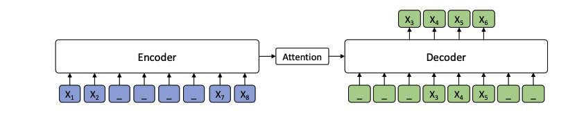
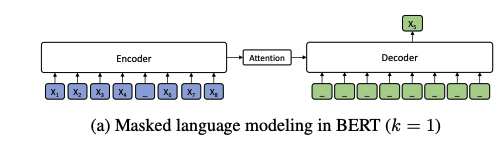
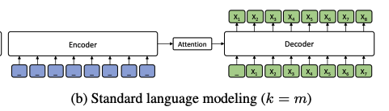

# 预训练语言模型 - 自然语言生成

## MASS

### 1. 语言模型思想



MASS 的思想很简单， 对于输入序列 x，  mask 该句从 u 到 v 位置上的token，记为 $x^{\u:v}$， 而对应的， 从 u 到 v 位置上的 token 片段记为 $x^{u:v}$ 。 k = v - u + 1 表示 mask 的窗口大小 ， 表示一句话中多少个 token 被 mask 。 对于 MASS 的语言模型来说， 其输入为 mask 后的序列 $x^{\u:v}$ ， 输出为被 mask 后的序列 $x^{u:v}$。

同时， MASS 将 Seq2Seq 的思想融入进去，这样就可以同时预测连续的词，从模型上看，我们也能推断它的生成效果是要好于Bert 的。 MASS 的损失函数为：
$$
P(s) = P(x^{u:v} | x^{\u:v})\\
$$

$$
L(\theta; X) = \frac{1}{|X|}  \sum_{x \in X} log P(x^{u:v} | x^{\u:v}; \theta) \\
= \frac{1}{X} \sum_{x \in X} log \prod_{t=u}^v P(x_t^{u:v} | x_{<t}^{u:v}, x^{\u:v}; \theta)
$$
### 2. MASS vs Bert

前面提到， MASS 中有一个重要的参数 k， 该参数决定对于输入序列 x， 多少个 token 会被 mask 掉， 而 Bert 中会 mask 掉 15% 的token（MASS 3.2中是不是讲错了，并不是mask一个token呀）， 且 Bert 属于随机 mask， 而 MASS 是 mask 连续的 token。

MASS 原论文中谈及 Bert ，认为 Bert 一句话中只 mask 掉一个token， 因此它有一个比较：



而 Bert 其实在一句话中会 mask 掉15% 的token， 难道是我理解有问题？ 

还有一点需要注意的是， BERT 并不是 encoder-decode 结构，这里只是为了比较把它转化为 encoder-decoder 结构，严格来说，bert 是一个 Encoder。

### 3. MASS 与 GPT



当 k = m 时， 与 GPT 的情形一样。注意，GPT 同样也不是一个 encoder-decoder 结构， 严格来说，它是一个 Decoder。

### 4. 为何 MASS 适合生成

**首先，** 通过 Seq2Seq 框架来预测被 mask 的tokens 使得 Encoder 去学习没有被 mask 的 token 的信息， 而Decoder 去学习如何从 Encoder 中提取有效的信息。

**然后，** 与预测离散的 tokens相比，Decoder 通过预测连续的 tokens， 其能够建立很好的语言生成能力。

**最后，** 通过输入与输出的 mask 匹配， 使得 Decoder 能够从Encoder 中提取到有意义的信息，而不是利用之前的信息。 （其实是一句有用的废话）

### 5. MASS 小结

MASS 总结来说有以下几点重新：

- 引入了 Seq2Seq 来训练预训练模型。
- **mask 掉的是一段连续的tokens而不是离散的 mask， 有助于模型生成语言的能力。**
- Encoder 中是 mask 掉的序列，而 Decoder 中是对应被mask的 tokens。

## UNILM

UNILM  就厉害了， 它想直接训一个预训练语言模型， 又能做自然语言理解，又能做自然语言生成。UNILM 的基本单元依旧是多层的 Transformer， 不同的是，这些 Transformer 网络要在多个语言模型上进行预训练：  unidirectional LM， bidirectional LM 和 Seq2Seq LM ， 下文会忽略一些细枝末节，主要专注如何预训练语言模型的。

**UNILM 这篇文章，厉害在同时使用多个预训练语言模型训练这个思想**， 至于怎么做，我觉得倒是其次，不是很重要。

大致的框架如下：


**1， Input Representation**

这部分与Bert 大同小异， 不过还是得细说一下。 UNILM 的输入为单词序列，序列可能是一个针对unidirectional LMs的文本段， 也有可能是针对 bidirectional LM 和 Seq2Seq LM的一对文本段。 输入的序列格式如下：

```
[SOS] + segment1 + [EOS]
[SOS] + segment1 + [EOS] + segment2 + [EOS]
```

与 Bert 相同， 模型的输入都为：

```
token embedding + position embedding + segment embedding
```

还有一点是， UNILM 将所有的 token 都处理成为 subword， 可以增强生成模型的表现能力，emmm， maybe？ 我觉得不是重点。

**2，Unidirectional LM **

输入单段落， UNILM 同时采用 left-to-right LM 与 right-to-left LM 来做（有点像 ELMO）， 这与 Bert 的方式有很大的区别， 我想这是从生成方面考虑因此如此设计， 细节，懒得抠了， 感兴趣的可以看看。

**3，Bidirectional LM **

输入段落对， 其实就是 Bert 的那种训练方式， 没啥好说的， 略。

**4， Seq2Seq LM**

输入段落对， 第一段采用 Bidirectional LM 的方式编码， 而对于第二句采用 Unidirectional LM 的方式解码， 然后同时训练。

**5， Next Sentence Prediction**

没啥好说的，和 Bert 里面差不多，略。

**7. 参数从 Bert-large 初始化**


## BART

BART 与 MASS 的基本思想一致，都是受到 Transformer 在机器翻译领域的成功，尝试将 Transformer架构跟预训练结合起来。

但是与 MASS 不同的是，他们输入的数据格式有很大的差别，Decoder 也有较大的差别。与MASS 相比， BART 完全延续 Transformer 原来的架构方式。

**训练数据：**

- **Token Masking** 和BERT一样，随机选择**token**用[MASK] 代替。
- **Token Deletion** 随机删除**token**，模型必须确定哪些**位置**缺少输入。
- **Text Filling** 屏蔽一个**文段**，文段长度服从泊松分布（λ=3）。每个文段被**一个[MASK]**标记替换。如果文段长度为0，意味插入一个[MASK]标记（灵感来自Span-BERT）。
- **Sentence Permutation** 以句号作为分割符，将一篇文章分成多个**句子**，并随机打乱。
- **Document Rotation** 随机均匀地选择一个**token**，以这个token为中心，旋转文档，选中的这个token作为新的开头，此任务训练模型以识别文档的开头。


## Questions

**1， MASS 中的 mask策略？**

对于 MASS  而言， 其采用随机 Mask 一段连续的 tokens， 有没有更佳的方式来学习， 比如， 30% mask 前面的 tokens， 20% mask 后面的tokens， 50% 随机mask 中间tokens。 这是考虑到对于句子生成来说， 开头和结尾可能需要更充分的训练与学习。

**2， Bert 能不能直接做 Encoder 端**

用已经学习好的**预训练语言模型（如Bert）**来做 Encoder 端（Freeze Encoder 端的参数）会不会更能把握输入序列的信息， 因为毕竟预训练语言模型在自然语言理解上已经获得了很大的成功，Decoder 只要学习如何从理解后的信息中提取信息来生成语言即可，这样能够大大减轻训练的时间和复杂度，或许效果也会更好。

**3， MASS vs UNILM**

二者相比，无疑 UNILM 更胜一筹，无论是从创新角度还是模型复杂度与精致程度而言。 但对于未来的发展来说，我个人更看好 **Encoder-Decoder** 这种方式， 语言生成是基于语言理解的基础上的，那么语言理解所诞生的预训练语言模型为何不直接用到生成预训练模型里面呢？ 有必要从头训吗？ 有必要**生成+ 理解**一起训吗？


## mBART


## PEGASUS


## 最后

其实，我想表达的核心在于， **理解与生成是否共存？** 如果共存， 以哪种方式？ **多任务学习**会不会是一个解法， **GPT 2.0** 这种单纯**堆数据和模型 + 无监督下游任务**会不会是正解？ **有没有可能用多阶段的预训练任务来做，先做理解，然后以理解的预训练语言模型为Encoder 来做生成预训练， 最后再在下游任务微调生成？**还是像 UNILM 那样走多预训练语言模型共同训练的方式。

我现在倒是觉得， 目前预训练模型走的路子与认知神经科学有着很相似的地方。自然语言理解目前已经实现突破， 相信接下来自然语言生成将成为主要战场。 


## Reference


[1] https://mp.weixin.qq.com/s/tQ4GyNxVYR9mKwnaAfeAbQ

【1】[阿士比亚：搜索团队智能内容生成实践](https://yq.aliyun.com/articles/431463)

【2】 [阿里-搜索团队智能内容生成实践](https://zhuanlan.zhihu.com/p/33956907)

https://www.infoq.cn/article/WiEUHYwyqFsYJIgLUed5

A Survey of Knowledge-Enhanced Text Generation

https://mp.weixin.qq.com/s/XdenY85LTpqC2p4HLe5CAw

https://mp.weixin.qq.com/s?__biz=MzIwMTc4ODE0Mw==&mid=2247514230&idx=1&sn=97ff879c8b80d281b26319ba08357afd&chksm=96ea67f6a19deee0dfd554f0ae1ee5d3ab49dbcf1d44fd0c2fa170e0d0420b9980136aaaa5df&token=2093744412&lang=zh_CN&scene=21#wechat_redirect