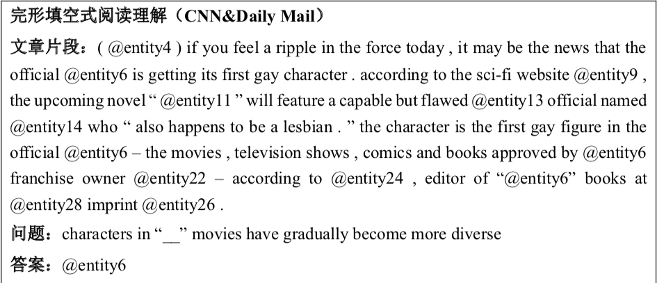
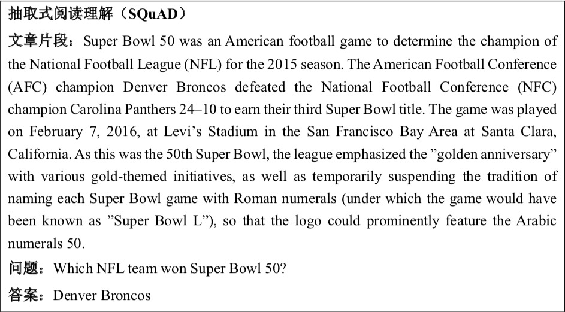
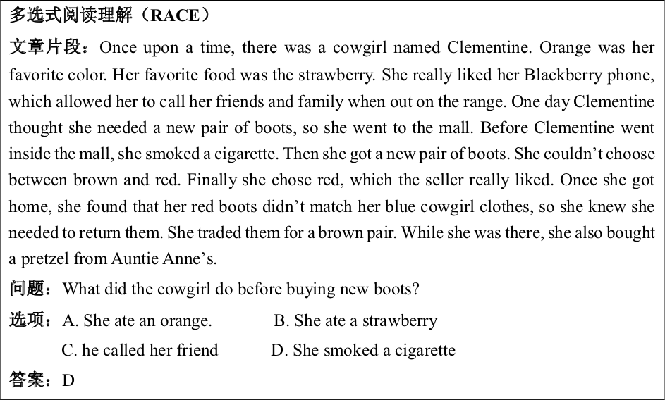

# 阅读理解数据集综述

## 1. 阅读理解任务定义

阅读理解任务可以被当作是一个有监督学习问题，具体来说，该任务可 以详细描述为:给定一个数据集 T，其中 T 的每一个样本都以下的三元组来表示:
$$
T = {(P_i, Q_i, A_i)}_{i=1}^n
$$
其中，$P_i$ 代表第 $i$ 个样本中的文章片段，$Q_i$ 代表第 $i$ 个样本中的问题，$A_i$  代表第 $i$  个样本中根据文章和问题所回答的答案。阅读理解的任务是通过学习得到一个预测函数 $f$ ，使得我们能够通过给定的 $P_i$  与 $Q_i$  来预测出 $A_i$ :
$$
f(P_i, Q_i) \to A_i
$$
通俗来讲，阅读理解任务就是通过给定一个文章片段，给定一个问题，要求计算机能够通过文章片段与问题来获得答案。

## 2. 阅读理解任务类型

阅读理解有多种类型，其划分的一个主要依据是根据答案的类型进行划分，这么区分的主要原因在于答案的不同使得模型输出层，损失函数，评估方式等发生很大变化。

目前来看，阅读理解任务根据具体答案形式的不同可以大致区分为以下四类:

- **填空式阅读理解。**

  填空式阅读理解有一个很明显的特点：答案往往是一个单词而非句子。填空式阅读理解任务可以描述为:给定一段文章片段与一个问题，要求机器根据文章片段与问题来推理出合理的答案， 且答案往往是文章片段的某个词。

  填空式阅读理解在阅读理解发展的早 期起到了至关重要的作用，现在已经退出主流数据集了，具体典型的数据集 有:CNN&Daily Mail，Who did What等数据集。

- **抽取式阅读理解。**

  抽取式阅读理解任务可以描述为:给定一段文章片 段，给定一个问题，要求机器根据该问题从文章片段中找出一个连续的片段作为答案。

  考虑到输出问题，此类问题又转化为预测答案的开始与结束的两 个位置 $pos_{start}$ 与 $pos_{end}$ 。此时，问题就转化成为一个分类问题，答案可以用篇章词片段表示为 $[ pos_{start} , pos_{end} ]$ 。

  在过去两年中，此类数据集一直是学术界的主流数据集，极大的推动了阅读理解领域的发展，其中最典型的数据集包括 SQuAD，MS Marco，NewsQA，TriviaQA等数据集。

- **多选式阅读理解。**

  多选式阅读理解任务可以描述为：给定一段文章片段，给定一个问题，给定多个选项，要求机器根据文章片段与问题从答案选项中选择一个最合适的答案。

  通过将阅读理解问题转化为分类问题可以更准 确的评估机器对语言的理解能力，这也是此类数据集强于抽取式数据集的一 大原因。

  此类数据集是目前研究人员研究的热点之一，代表性的数据集有 RACE，CLOTH等。

- **生成式阅读理解。**

  生成式阅读理解任务可以描述为：给定一段文章片 段，给定一个问题，要求机器基于文章片段与问题生成一个合适的答案，该答案不局限于文章中存在的词语，而是自由生成的。

  此类型的阅读理解任务 更适合实际生活场景，但是由于生成的句子无法做准确评估，因此一直无法 成为业界的主流数据集。代表性的数据集有 NARRATIVEQA，CoQA等。

## 3. 阅读理解任务的评估方式

| 任务类型       | 评估方法           |
| -------------- | ------------------ |
| 填空式阅读理解 | 准确率(Accuracy)   |
| 抽取式阅读理解 | EM(完全匹配值)，F1 |
| 多选式阅读理解 | 准确率(Accuracy)   |
| 生成式阅读理解 | BLEU，ROUGE        |

对于抽取式阅读理解任务，由于答案通常为一个片段，一般同时采用两
种评估方式:

- 完全匹配值(Exact Match，EM)。该指标用来判定预测的答案与给 定的答案是否完全相同，即预测的开始位置 $pos^{pred}_{start}$ 与终止位置 $pos^{pred}_{end}$ 是否与真实值相同，其计算公式下：
  $$
  EM = \begin{cases} 1, & pos^{pred}_{start} == pos^{real}_{start}  \, and \, pos^{pred}_{end} == pos^{real}_{end} \\ 0, & otherwise \end{cases}
  $$

- F1 值。该指标主要评估预测的答案片段与正确答案的重合率，其计 算公式如下所示：
  $$
  F1 = \frac{2 \times Precision \times Recall}{Precision + Recall}
  $$

## 4. 现有数据集分类

本节汇集了当前大多数的阅读理解数据集，并对其进行简单描述

### 1. 填空式阅读理解

考虑到这部分其实已经几乎没人在搞了，因此就不做详细描述了。

| 数据集            | 语言    | 状态             |
| ----------------- | ------- | ---------------- |
| MCTest [1]        | English | 过时，不推荐研究 |
| CNN/Daily Mail[2] | English | 过时，不推荐研究 |
| CBT[3]            | English | 过时，不推荐研究 |
| Quasar-S[4]       | English | 过时，不推荐研究 |

- CNN&Daily Mail： 最具代表的数据聚集，数据来源于CNN 和 Daily Mail。
- CBT：数据来源于儿童读物。

### 2. 抽取式阅读理解

https://www.leiphone.com/news/201903/QcmBwrYSo8QyWXRb.html

| 数据集                                                       | 语言        | 状态                                 |
| ------------------------------------------------------------ | ----------- | ------------------------------------ |
| [SQuAD 1.0](https://rajpurkar.github.io/SQuAD-explorer/) [5] | English     | 过时                                 |
| [**SQuAD 2.0**](https://rajpurkar.github.io/SQuAD-explorer/) [6] | **English** | **热点**                             |
| [**DuReader**](https://zhuanlan.zhihu.com/p/36415104)        | **Chinese** | **热点**                             |
| [**MS MARCO**](https://zhuanlan.zhihu.com/p/53525750)        | **English** | **非研究热点，但跟搜索引擎紧密结合** |
| [CoQA](https://zhuanlan.zhihu.com/p/43050014) [9]            | English     | 热点，接替SQuAD                      |
| [TriviaQA](http://nlp.cs.washington.edu/triviaqa/) [10]      | English     | 热点                                 |
| [HotpotQA](https://hotpotqa.github.io/) [11]                 | English     | 热点                                 |
| Quasar-T [4]                                                 | English     | 非研究热点                           |
| SearchQA[12]                                                 | English     | 非研究热点                           |
| [CMRC 2018](https://hfl-rc.github.io/cmrc2018/open_challenge/) | Chinese     | 研究热点                             |
| [CMRC 2019](https://hfl-rc.github.io/cmrc2019/)              | Chinese     | 热点                                 |
| [NewsQA](https://www.microsoft.com/en-us/research/project/newsqa-dataset/) [13] | English     | 有点意思                             |
| [QuAC](http://quac.ai/) [14]                                 | English     | 非热点                               |

- SQuAD 1.0：来源于维基百科，给定 context 于 question， 从 context 中截取一个片段，该片段作为答案。 是一个典型的抽取式问题。

- SQuAD 2.0：在 SQuAD 1.0 的基础上新增超过5万无法回答的问题。这要求模型不仅要在能够在问题可回答时给出答案，还要判断哪些问题是阅读文本中没有材料支持的，并拒绝回答这些问题。

- DuReader： 中文阅读理解数据集，应该是国内最棒的阅读理解数据集。它的格式跟 下面的 MS MARCO 相似。DuReader中的问题和文档均来自百度搜索和百度知道。答案是人为产生的，而不是原始上下文中的片段。DuReader之所以与众不同，是因为它提供了新的问题类型，例如yes、no和opinion。与事实性问题相比，这些问题有时需要对文档的多个部分进行汇总。

- MS MARCO：， 很工业化的数据集，来自Bing 用户查询，因此跟搜索引擎技术紧密相连，十分适合学习。为了克服以前的数据集的弱点，它具有四个主要功能。

  首先，所有问题都是从真实用户查询中收集的；

  其次，对于每个问题，使用Bing搜索引擎搜索10个相关文档作为上下文；

  第三，人为这些问题标注了答案，因此它们不仅限于上下文范围，还需要更多的推理和总结；

  最后，每个问题有多个答案，有时甚至冲突，这使得机器选择正确的答案更具挑战性。MS MARCO使MRC数据集更接近真实世界。

- CoQA：， 对话式阅读理解数据集，这跟现实生活又近了一步，是现在研究的热点。CoQA包含约8000轮对话，问题的答案有五种类型，分别为Yes、No、Unknown，文章中的一个span和生成式答案。当根据文章和之前的对话信息无法回答当前问题时，答案为Unknown。该数据集不仅提供答案，而且给出了答案的依据，每一种类型的答案的依据都是文章中的一个span。

- TriviaQA：。该数据集构造问答对，然后从维基百科等页面中寻找对应的论据。最终通过上述方式构造了约65,000个“问题-答案-论据”三元组，通过这种方式构造的数据集比SQuAD更接近实际使用场景。对比SQuAD数据集，其主要集中于是推理方面的问题，并且实验证明一些在SQuAD上表现良好的模型在TriviaQA上并不能获得理想的结果。

- HotpotQA：研究基于多个信息内容的多步推理，然后回答问题。这意味着答案并不仅仅来源于单一文档。

- Quasar-T：不建议深入研究。

- SearchQA：作者构建该数据集的目的是构建能反映检索系统噪声的阅读理解数据集，作者通爬取 Jeopardy 上的问题，然后将问题作为query 在Google 上检索，获得 answer snippets。 该数据集是通过程序生成的，因此噪声不可避免的比较高，因此不建议深入研究。

- NewsQA：该数据集是从CNN新闻网站上构造的，构造方法与SQuAD一致。

- QuAC： 对话式阅读理解数据集。

### 3. 多选式阅读理解

| 数据集                                                       | 语言    | 状态             |
| ------------------------------------------------------------ | ------- | ---------------- |
| [RACE](http://www.qizhexie.com//data/RACE_leaderboard) [15]  | English | 热点，可研究     |
| [CLOTH](http://www.qizhexie.com/data/CLOTH_leaderboard) [16] | English | 一般，已解决     |
| [ARC](https://allenai.org/data/arc) [17]                     | English | 一般，不推荐     |
| Who did What [18]                                            | English | 过时，不推荐研究 |
| [OpenBookQA](https://leaderboard.allenai.org/open_book_qa/submissions/public) [19] | English | 一般，不推荐     |
| [CommonsenseQA](https://www.tau-nlp.org/commonsenseqa)  [20] | English | 一般，不推荐     |
| [COSMOS QA](https://wilburone.github.io/cosmos/) [21]        | English | 一般             |

- RACE： RACE 取自于中国中高考阅读理解题型，我个人认为这是目前最能体现阅读理解能力的数据集之一，十分值得研究。
- CLOTH：来自中文中高考完形填空题型，相较于RACE， CLOTH 天然的适合 BERT 这种 AE 模型来填词，因此 CLOTH 可以说是已经被解决了，准确率比人高。
- ARC：ARC 取自中学生考试中的科学问题，并进一步分为ARC-Challenge 于 ARC-Easy 两个子集，共包含大约8000个问题，此外，该数据集中提供与该任务相关的包含14M科学事实的语料库用来回答这些问题。
- OpenBookQA：包含大约6000个问题，每个问题包括四个选项，此外，与ARC数据集相似，该数据集也提供了参考语料库，包含1326个事实，每个问题期望结合语料库中的某一个事实来得到答案。此外，还需要结合一些常识知识。如何准确的利用参考语料库与常识知识成为了该数据集的主要问题之一。
- CommonsenseQA：来自于ConceptNet，其包含大约12000个需要结合背景知识的问题。在该数据集中，标注者根据ConceptNet中的实体概念来自由构造问题，来使问题包含人类所具有的、但难以在网络资源中检索到的背景知识，故回答问题需要利用问题、候选答案，以及仅仅使用检索策略无法检索到的背景知识。
- COSMOS QA：包含35600个需要常识阅读理解的问题，其专注于解决需要跨越上下文、而不是定位指定片段的推理问题。

### 4. 生成式阅读理解

生成式阅读理解目前还没有热起来的趋势，相关的数据集也没有进入主流视野，个人不建议做这方面的研究。 这一大原因在于文本生成作为单一的任务迟迟得不到突破，至少目前为止（2020年），看不到突破的影子，个人觉得还需要一些时间。

### 5. 其他

其他还有一些数据集，如bAbi，LAMBADA， SCT，MCScript，NarrativeQA，DuoRC，CliCR，WikiQA 等，水平有限，累了，就不做赘述了。

## 最后

本文总结了大多数的数据集，但是并没有对数据集进行详细描述，一来是因为工作量比较大，二来是觉得没有必要。 一般做阅读理解紧跟几个主流数据集就行，太多数据集反而会乱了自身阵脚。

## Reference

### 1. 博客参考

[赛尔笔记 | 机器阅读理解简述](https://zhuanlan.zhihu.com/p/111410698)

[RCPapers](https://github.com/thunlp/RCPapers)

### 2. 填空式阅读理解

[1] (MCTest) **MCTest: A Challenge Dataset for the Open-Domain Machine Comprehension of Text.** Matthew Richardson, Christopher J.C. Burges, and Erin Renshaw. EMNLP 2013. [paper](http://www.aclweb.org/anthology/D13-1020).

[2] (CNN/Daily Mail) **Teaching Machines to Read and Comprehend.** Hermann, Karl Moritz, Tomas Kocisky, Edward Grefenstette, Lasse Espeholt, Will Kay, Mustafa Suleyman, and Phil Blunsom. NIPS 2015. [paper](https://papers.nips.cc/paper/5945-teaching-machines-to-read-and-comprehend.pdf)

[3] (CBT) **The Goldilocks Principle: Reading Children's Books with Explicit Memory Representations.** Felix Hill, Antoine Bordes, Sumit Chopra, and Jason Weston. arXiv preprint arXiv:1511.02301 (2015). [paper](https://arxiv.org/pdf/1511.02301)

[4] (Quasar) **Quasar: Datasets for Question Answering by Search and Reading.** Bhuwan Dhingra, Kathryn Mazaitis, and William W. Cohen. arXiv preprint arXiv:1707.03904 (2017). [paper](https://arxiv.org/pdf/1707.03904)

### 3. 抽取式阅读理解

[5 ]  (SQuAD 1.0) **SQuAD: 100,000+ Questions for Machine Comprehension of Text.** Pranav Rajpurkar, Jian Zhang, Konstantin Lopyrev, and Percy Liang. EMNLP 2016. [paper](https://aclweb.org/anthology/D16-1264)

[6] (SQuAD 2.0) **Know What You Don't Know: Unanswerable Questions for SQuAD.** Pranav Rajpurkar, Robin Jia, and Percy Liang. ACL 2018. [paper](http://aclweb.org/anthology/P18-2124)

[7] (DuReader) **DuReader: a Chinese Machine Reading Comprehension Dataset from Real-world Applications.** Wei He, Kai Liu, Yajuan Lyu, Shiqi Zhao, Xinyan Xiao, Yuan Liu, Yizhong Wang, Hua Wu, Qiaoqiao She, Xuan Liu, Tian Wu, and Haifeng Wang. ACL 2018 Workshop. [paper](https://arxiv.org/abs/1711.05073)

[8]  (MS MARCO) **MS MARCO: A Human Generated MAchine Reading COmprehension Dataset.** Tri Nguyen, Mir Rosenberg, Xia Song, Jianfeng Gao, Saurabh Tiwary, Rangan Majumder, and Li Deng.  arXiv preprint arXiv:1611.09268 (2016). [paper](https://arxiv.org/pdf/1611.09268)

[9] (CoQA) **CoQA: A Conversational Question Answering Challenge.** Siva Reddy, Danqi Chen, and Christopher D. Manning. arXiv preprint arXiv:1808.07042 (2018). [paper](https://arxiv.org/pdf/1808.07042)

[10] (TriviaQA) **TriviaQA: A Large Scale Distantly Supervised Challenge Dataset for Reading Comprehension.** Mandar Joshi, Eunsol Choi, Daniel S. Weld, Luke Zettlemoyer. arXiv preprint arXiv:1705.03551 (2017). [paper](https://arxiv.org/pdf/1705.03551)

[11] (HotpotQA) **HotpotQA: A Dataset for Diverse, Explainable Multi-hop Question Answering**. Yang Z , Qi P , Zhang S , et al. . 2018.[paper](https://arxiv.org/abs/1809.09600v1)

[12] (SearchQA) **SearchQA: A New Q&A Dataset Augmented with Context from a Search Engine.** Matthew Dunn, Levent Sagun, Mike Higgins, V. Ugur Guney, Volkan Cirik, and Kyunghyun Cho. arXiv preprint arXiv:1704.05179 (2017). [paper](https://arxiv.org/pdf/1704.05179)

[13] (NewsQA) **NewsQA: A Machine Comprehension Dataset.** Adam Trischler, Tong Wang, Xingdi Yuan, Justin Harris, Alessandro Sordoni, Philip Bachman, and Kaheer Suleman. arXiv preprint arXiv:1611.09830 (2016). [paper](https://arxiv.org/pdf/1611.09830)

[14] (QuAC) **QuAC : Question Answering in Context.** Eunsol Choi, He He, Mohit Iyyer, Mark Yatskar, Wen-tau Yih, Yejin Choi, Percy Liang, and  Luke Zettlemoyer. arXiv preprint arXiv:1808.07036 (2018). [paper](https://arxiv.org/pdf/1808.07036)

### 3.  多选式阅读理解

[15] (RACE) **RACE: Large-scale ReAding Comprehension Dataset From Examinations.** Guokun Lai, Qizhe Xie, Hanxiao Liu, Yiming Yang, and Eduard Hovy. EMNLP 2017. [paper](http://aclweb.org/anthology/D17-1082)

[16] (CLOTH) **Large-scale Cloze Test Dataset Created by Teachers.** Qizhe Xie, Guokun Lai, Zihang Dai, and Eduard Hovy. EMNLP 2018. [paper](https://arxiv.org/pdf/1711.03225)

[17] (ARC) **Think you have Solved Question Answering?Try ARC, the AI2 Reasoning Challenge.** Peter Clark, Isaac Cowhey, Oren Etzioni, Tushar Khot,Ashish Sabharwal, Carissa Schoenick, and Oyvind Tafjord. arXiv preprint arXiv:1803.05457 (2018). [paper](https://arxiv.org/pdf/1803.05457)

[18] (Who did What) **Who did What: A Large-Scale Person-Centered Cloze Dataset** Takeshi Onishi, Hai Wang, Mohit Bansal, Kevin Gimpel, and David McAllester. EMNLP 2016. [paper](https://aclweb.org/anthology/D16-1241)

[19] (OpenBookQA) Mihaylov T, Clark P, Khot T, et al. Can a suit of armor conduct electricity? a new dataset for open book question answering[J].  2018. [paper](https://arxiv.org/abs/1809.02789)

[20] Talmor A, Herzig J, Lourie N, et al. Commonsenseqa: A question answering challenge targeting commonsense knowledge[J]. 2018. [paper](https://arxiv.org/abs/1811.00937)

[21] Huang L, Bras R L, Bhagavatula C, et al. Cosmos QA: Machine reading comprehension with contextual commonsense reasoning[J]. arXiv, 2019. [paper](https://arxiv.org/abs/1909.00277)

### 其他

[22] (bAbi) **Towards AI-Complete Question Answering: A Set of Prerequisite Toy Tasks.** Jason Weston, Antoine Bordes, Sumit Chopra, Alexander M. Rush, Bart van Merriënboer, Armand Joulin, and Tomas Mikolov. arXiv preprint arXiv:1502.05698 (2015). [paper](https://arxiv.org/pdf/1502.05698)

[23] (LAMBADA) **The LAMBADA Dataset:Word Prediction Requiring a Broad Discourse Context.** Denis Paperno, Germ ́an Kruszewski, Angeliki Lazaridou, Quan Ngoc Pham, Raffaella Bernardi, Sandro Pezzelle, Marco Baroni, Gemma Boleda, and Raquel Fern ́andez. ACL 2016. [paper](https://www.aclweb.org/anthology/P16-1144)

[24] (SCT) **LSDSem 2017 Shared Task: The Story Cloze Test.** Nasrin Mostafazadeh, Michael Roth, Annie Louis,Nathanael Chambers, and James F. Allen. ACL 2017 workshop. [paper](http://aclweb.org/anthology/W17-0906)

[25] (MCScript) **MCScript: A Novel Dataset for Assessing Machine Comprehension Using Script Knowledge.** Simon Ostermann, Ashutosh Modi, Michael Roth, Stefan Thater, and Manfred Pinkal. arXiv preprint arXiv:1803.05223.  [paper](https://arxiv.org/pdf/1803.05223.pdf)

[26] (NarrativeQA) **The NarrativeQA Reading Comprehension Challenge**.
Tomáš Kočiský, Jonathan Schwarz, Phil Blunsom, Chris Dyer, Karl Moritz Hermann, Gábor Melis, and Edward Grefenstette. TACL 2018. [paper](http://aclweb.org/anthology/Q18-1023)

[27] (DuoRC) **DuoRC: Towards Complex Language Understanding with Paraphrased Reading Comprehension.** Amrita Saha, Rahul Aralikatte, Mitesh M. Khapra, and Karthik Sankaranarayanan. ACL 2018. [paper](http://aclweb.org/anthology/P18-1156)

[28] (CliCR) **CliCR: a Dataset of Clinical Case Reports for Machine Reading Comprehension.** Simon Suster and Walter Daelemans. NAACL 2018. [paper](http://aclweb.org/anthology/N18-1140) 