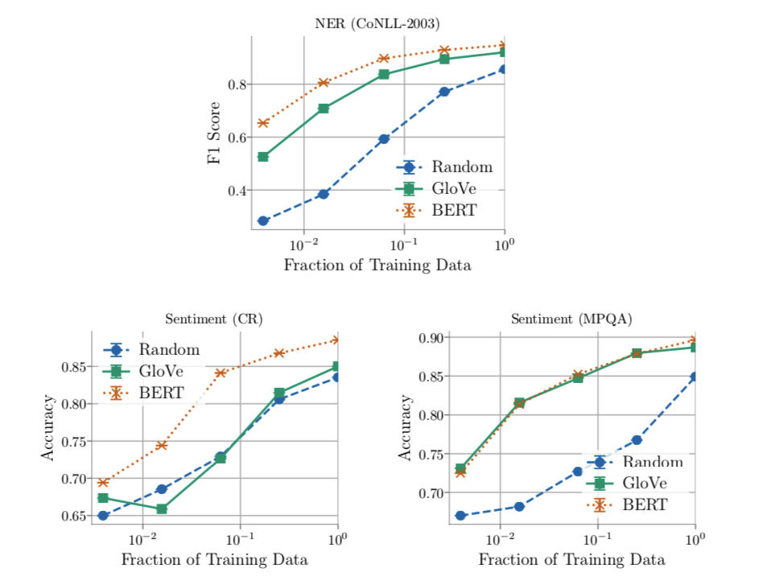
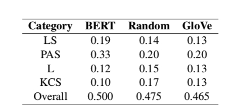

# BERT 可解释性

## BERT 向量 vs Glove 向量[4]

这篇文章对比了 BERT ，Glove，random 三种向量， 我们都知道， BERT 相对于其他两种向量，其效果提升非常明显，本文基于此，探讨与传统词向量相比，BERT向量优异在何处呢？

 为了对比不同词向量的在下游任务的表现，本文采用了三个任务： 

- NER： 词汇级别的任务
- sentiment analysis：句子级别的任务
- GLUE：句子对级别的任务

为了更加纯粹对比三种向量，三种词向量在训练时均不微调，如果微调的话，就会难以判断是模型的作用还是词向量本身的作用。

### 1.  数据规模的影响

实验表明，下游任务的训练数据对于不同的向量影响是十分不同的， 结果如下图所示：

从上图中我们可以看出

- 随着数据规模的扩大，Glove 向量的表现与 BERT 向量的表现差距越来越小，但在绝大多数情况下依旧比BERT 向量差很多，这说明 BERT 对于小数据集的优越性。

- 在简单任务上，随着数据量的增加， Glove 能达到 BERT 十分接近的效果

### 2. 语言特性

本节主要分析，相对于 Glove ，BERT 向量主要在哪些方面获得了提升。本节采用 GLUE diagnostic task，该任务主要从四个方面考察语言特性：

- lexical semantics (LS)
- predicate-argument structure (PAS)
- logic (L)
- knowledge and com- mon sense (KCS)

BERT，Glove，Random 向量的结果对比如下：

从上表中得出如下结论：

- Glove 与 Random 在四个语言特性上表现相似
- 在 PAS 上，

https://zhuanlan.zhihu.com/p/145695511

## BERT vs ELMO vs Flair [6]

对比这三种方法在

https://zhuanlan.zhihu.com/p/63746935

## BERT 各层向量学到了什么？[1]

从 1 的描述中分析 BERT 各层对短语，语法， 语义等信息的学习情况

https://www.jiqizhixin.com/articles/2019-09-09-6

https://zhuanlan.zhihu.com/p/74515580

## BERT Attention 学到了什么

https://zhuanlan.zhihu.com/p/148729018

## Reference

[1] What does BERT learn about the structure of language?  -- 2019-6-4

[2] What Does BERT Look At? An Analysis of BERT's Attention -- 2019-6-11

[3] A multiscale visualization of attention in the transformer model  --2019-6-12

[4] Contextual Embeddings: When Are They Worth It?  -- 2020-3-18

[5] A Primer in BERTology: What we know about how BERT works --2020-2-27

[6] Does BERT make any sense? interpretable word sense disambiguation with contextualized embeddings

 https://www.jiqizhixin.com/articles/2019-09-09-6

https://zhuanlan.zhihu.com/p/148729018

https://zhuanlan.zhihu.com/p/74515580

https://lsc417.com/2020/06/19/paper-reading3/#prevalence-of-unseen-words

https://zhuanlan.zhihu.com/p/145695511

