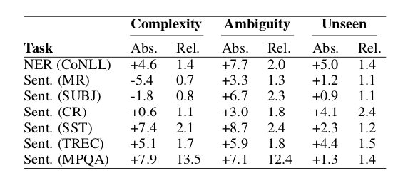
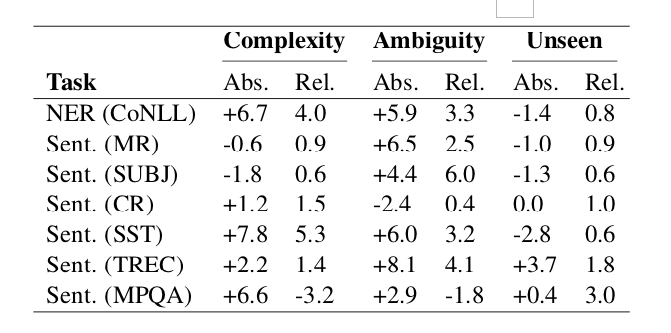
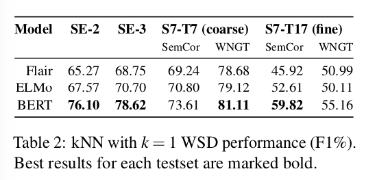
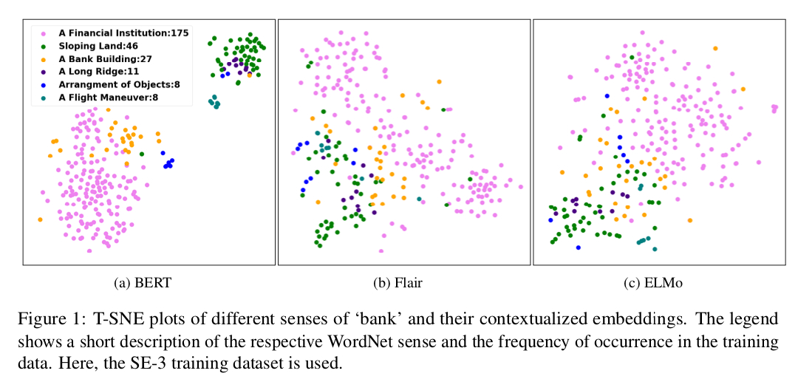

# BERT 可解释性

## 分析可解释性的一些常见方法

- Probing tasks： 通过设计一些独立性较强的简单任务，来验证模型的不同层再不同Probing task 上的能力，进而得到模型对数据的深入解释
- Visualization：一般都是通过可视化 Attention 系列来对模型做出解释。
- Adversarial attacks：对抗性攻击通过使用特定干扰信息创建的例子来验证模型的鲁棒性


## What does BERT Learn from Multiple-Choice Reading Comprehension Datasets[1]

- an un-readable data attack, in which we add keywords to confuse BERT, leading to a significant performance drop
- an un-answerable data training, in which we train BERT on partial or shuffled input


###  1. Un-Readable Data Attack

The un- readable data is mainly obtained by randomly shuf- fling the word order of the input to make it gram- matically wrong and un-readable.

- We first fine-tune BERT on the original MCRC data and then test it under adversarial attacks. 
- 

### 2. Un-Answerable Data Training


## What does BERT learn about the structure of language[2]

本文通过设计不同粒度的任务探索 BERT 的不同层的向量能够扑捉到什么样的信息。

- 浅层网络能够捕捉到 phrase-level 信息，而这部分信息在高层被稀释了
- 中层网络能够捕捉到语法结构信息
- 顶层网络能够扑捉到语义信息
- BERT 需要深层网络才能学习到长距离的依赖

### 1. Phrasal Syntax

这部分主要验证 BERT 能否扑捉到短语级别的结构信息。 对于短语片段$(s_i,s_j)$， 通过 concat 片段在 l 层的第一个向量$h_i$和最后一个向量$s_j$进行 ，得到该短语的向量表示$S_{(s_i, s_j)}, l$。通过对CoNLL 2000 chunking dataset 进行随机抽取，可视化结果如下：


```
NP (noun phrase) # 名词短语
VP (verb phrase) # 动词短语
PP (prepositional phrase) # 介词短语
ADVP (adverb phrase)  # 副词短语
SBAR (subordinated clause) # 从句
ADJP (adjective phrase) # 形容词短语
PRT (particles) # 
CONJP (conjunction phrase) # 连词
INTJ (interjection)
LST (list marker)
UCP (unlike coordinated phrase)
```

从上图中可以得到：BERT 浅层能够扑捉到 phrase-level information，而随着层的加深，此特征被稀释了。


### 2. 探测任务(Probing Tasks)

Probing Tasks 主要是用来评估BERT每层向量对于不同语言信息的扑捉能力。本文的探测任务主要有十个，可以分为三组：

- Surface tasks（表层任务）：SentLen（）， WC
- Syntactic tasks（句法任务）：BShift， TreeDepth， TopConst
- Semantic tasks（语义任务）：Tense， SubjNum，SOMO， CoordInv


### 3. Subject-Verb Agreement


### 4. Compositional Structure


## Open Sesame: Getting Inside BERT’s Linguistic Knowledge


## BERT 向量 vs Glove 向量 [10]

这篇文章对比了 BERT ，Glove，random 三种向量， 我们都知道， BERT 相对于其他两种向量，其效果提升非常明显，本文基于此，探讨与传统词向量相比，BERT向量优异在何处呢？

 为了对比不同词向量的在下游任务的表现，本文采用了三个任务： 

- NER： 词汇级别的任务
- sentiment analysis：句子级别的任务
- GLUE：句子对级别的任务

为了更加纯粹对比三种向量，三种词向量在训练时均不微调，如果微调的话，就会难以判断是模型的作用还是词向量本身的作用。

### 1.  数据规模的影响

实验表明，下游任务的训练数据对于不同的向量影响是十分不同的， 结果如下图所示：


从上图中我们可以看出

- 随着数据规模的扩大，Glove 向量的表现与 BERT 向量的表现差距越来越小，但在绝大多数情况下依旧比BERT 向量差很多，这说明 BERT 对于小数据集的优越性。

- 在简单任务上，随着数据量的增加， Glove 能达到 BERT 十分接近的效果

### 2. 语言特性

本节主要分析，相对于 Glove ，BERT 向量主要在哪些方面获得了提升。本节采用 GLUE diagnostic task，该任务主要从四个方面考察语言特性：

- lexical semantics (LS)
- predicate-argument structure (PAS)
- logic (L)
- knowledge and common sense (KCS)

BERT，Glove，Random 向量的结果对比如下：


从上表中得出如下结论：

- Glove 与 Random 在四个语言特性上表现相似
- 在 PAS 上，BERT 明显好于 其余两个向量。 PAS 主要评测模型是否了解句子的短语是如何组合到一起的，比如：介词短语， 识别主语和宾语

接下来， 文章从三个角度来评测不同的向量：

- **the complexity of text structure：**句子结构的复杂性
- **Ambiguity in word usage**: 单词的歧义性。
- **Prevalence of unseen words**：未登录词出现的概率





从结果来看，以 BERT 为代表的 Contextual embeddings 在解决一些文本结构复杂度高和单词歧义性方面有显著的效果，但是在未登录词方面 GloVe 代表的Non-Contextual embeddings 有不错的效果。

从上面的结论可以看出，

- 在对于拥有大量训练数据和简单任务中，考虑算力和设备等，GloVe 代表的 Non-Contextual embeddings 是个不错的选择。
- 但是对于文本复杂度高和单词语义歧义比较大的任务，BERT代表的 Contextual embeddings 却有明显的优势。

https://zhuanlan.zhihu.com/p/145695511

## BERT vs ELMO vs Flair [9]

本文主要探讨这三种上下文向量在 WSD（word sense disambiguation）上的表现，进而判断上下文向量能否解决 WSD 问题。




|      |       |       |       |       |
| ---- | ----- | ----- | ----- | ----- |
| MFS  | 54.79 | 58.95 | 70.94 | 48.44 |

从上表中看出，BERT 要远高于baseline 模型，且要比其他上下文向量表现更佳。



从上图中我们得出如下结论：

- The Flair embeddings hardly allow to distinguish any clusters as most senses are scattered across the entire plot.
- In the ELMo embedding space, the major senses are slightly more separated in different regions of the point cloud
- Only in the BERT embedding space, some senses form clearly separable clusters


**BERT 的不足之处**

看 Error analysis


## BERT vs ELMO vs GPT-2


## BERT Attention 学到了什么

https://zhuanlan.zhihu.com/p/148729018


##  A Primer in BERTology: What we know about how BERT works


## Reference

[1] What does BERT Learn from Multiple-Choice Reading Comprehension Datasets? -- 2019-5

[2] What does BERT learn about the structure of language?  -- 2019-6-4

[3] Open Sesame: Getting Inside BERT’s Linguistic Knowledge - 2019-6

[4] What Does BERT Look At? An Analysis of BERT's Attention -- 2019-6-11

[5] A multiscale visualization of attention in the transformer model  --2019-6-12

[6] BERT Rediscovers the Classical NLP Pipeline -- 2019-8

[7] How Does BERT Answer Questions? A Layer-Wise Analysis of Transformer Representations -- 2019-9

[9] Does BERT make any sense? interpretable word sense disambiguation with contextualized embeddings

[10] Contextual Embeddings: When Are They Worth It?  -- 2020-3-18

[11] A Primer in BERTology: What we know about how BERT works --2020-2-27


How Contextual are Contextualized Word Representations?

Linguistic Knowledge and Transferability of Contextual Representations


 https://www.jiqizhixin.com/articles/2019-09-09-6

https://zhuanlan.zhihu.com/p/148729018

https://zhuanlan.zhihu.com/p/74515580

https://lsc417.com/2020/06/19/paper-reading3/#prevalence-of-unseen-words

https://zhuanlan.zhihu.com/p/145695511


https://zhuanlan.zhihu.com/p/110085059
